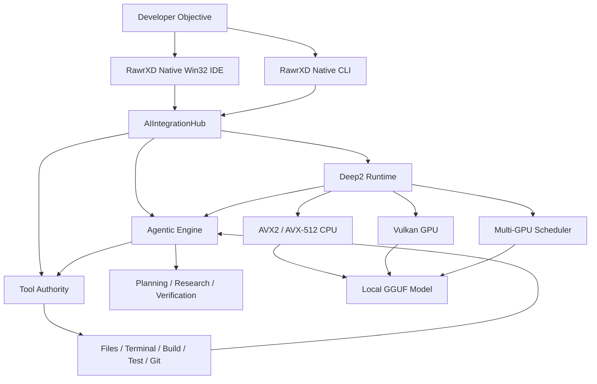
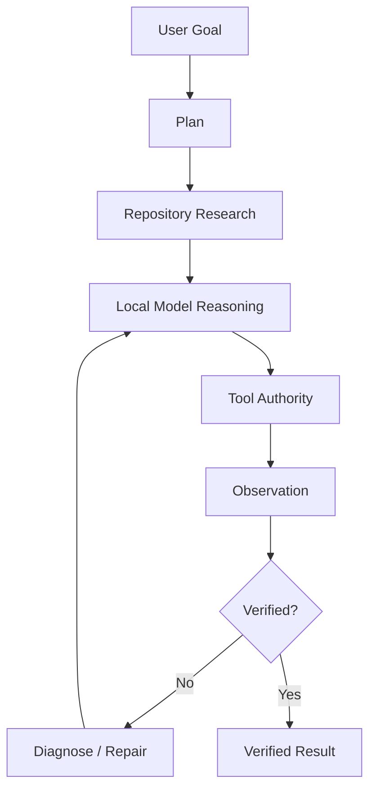
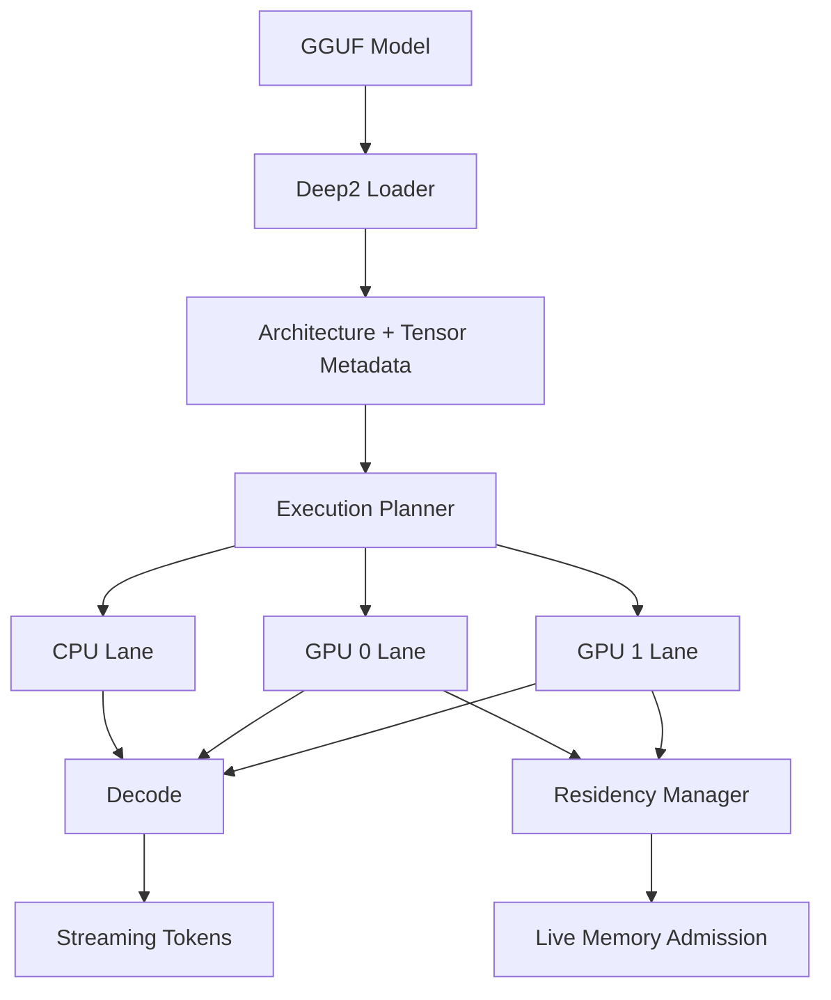

# RawrXD v3.0

## Native Agentic AI Development Environment
**Local Models · Native Inference · Autonomous Engineering · One Stack**

`Native Win32` · `C++20` · `Deep2` · `Vulkan` · `AVX2 / AVX-512` · `Multi-GPU` · `Local-First` · `MIT`

### Build. Run. Reason. Repair. Locally.

---

## RawrXD
**RawrXD** is a native Windows development environment built around two ideas:

1. **AI agents should be able to actually engineer software—not merely suggest code.**
2. **The inference engine powering those agents should be locally controllable too.**
RawrXD combines:

- a native **C++20 / Win32 IDE**
- an autonomous **agentic software-engineering engine**
- centralized **Tool Authority**
- the **Deep2 native inference runtime**
- direct local model execution
- native **Vulkan GPU compute**
- AVX2 / AVX-512 CPU acceleration
- heterogeneous multi-GPU scheduling
- repository-wide source research
- autonomous source modification
- terminal and process control
- build and test execution
- Git workflows
- runtime diagnostics
- local API serving
- self-correcting engineering loops
All inside one native product stack.

**No Electron shell required.**

**No mandatory Qt runtime.**

**No required cloud inference service.**

**No requirement to route supported local models through Ollama.**

---

# The Idea
Most AI coding products begin with:

```
Editor
  +
AI Assistant
```
Most local model runtimes begin with:

```
Prompt
  ↓
Model
  ↓
Tokens
```
RawrXD is being built around the complete engineering loop:

```
Developer Objective
        ↓
Repository Research
        ↓
Planning
        ↓
Local Model
        ↓
Tool Execution
        ↓
Source Modification
        ↓
Build
        ↓
Test
        ↓
Observation
        ↓
Diagnosis
        ↓
Repair
        ↓
Verification
        ↓
Verified Result
```
The model is one component.

**The engineering system is the product.**

---

# One Native AI Stack

```
┌──────────────────────────────────────────────────────────────┐
│                         RawrXD IDE                            │
│                    Native C++20 / Win32                       │
├──────────────────────────────────────────────────────────────┤
│                    AIIntegrationHub                           │
├──────────────────────────────┬───────────────────────────────┤
│       Agentic Engine         │        Tool Authority         │
│                              │                               │
│  Planning                    │  Files                        │
│  Repository Research         │  Search                       │
│  Verification                │  Terminal                     │
│  Self-Correction             │  Processes                    │
│  Code Surgery                │  Build / Test                 │
│  Task Execution              │  Git                          │
│                              │  Diagnostics                  │
├──────────────────────────────┴───────────────────────────────┤
│                          Deep2                               │
│                 Native Local Inference Runtime               │
├───────────────────┬──────────────────┬───────────────────────┤
│ CPU Kernels       │ Vulkan Compute   │ Multi-GPU Scheduler   │
│ AVX2 / AVX-512    │ GPU Execution    │ Residency / Admission │
├───────────────────┴──────────────────┴───────────────────────┤
│                     Local GGUF Models                        │
└──────────────────────────────────────────────────────────────┘
```

---

# Why RawrXD Exists
Modern AI development tooling is powerful, but it often separates the development environment from the model runtime.

RawrXD takes a different approach.

The editor, agent, execution authority, inference runtime, GPU scheduler, diagnostics system, CLI, and local server are designed as parts of the same application architecture.

That makes workflows possible such as:

```
rawr run modelname audit my IDE codebase for any stubs
```
with the intended execution path:

```
Resolve Model
     ↓
Load Through Deep2
     ↓
Open Repository
     ↓
Enumerate Source
     ↓
Research Implementations
     ↓
Find Stubs / Defects
     ↓
Build Repair Plan
     ↓
Modify Source
     ↓
Compile
     ↓
Run Tests
     ↓
Inspect Failures
     ↓
Repair
     ↓
Rebuild
     ↓
Verify
     ↓
Report
```
That is the core RawrXD vision.

---

# Major Capabilities

## Native Agentic Engineering
RawrXD contains a native agent execution system designed for multi-step software-development work.

The agent architecture can:

- inspect repositories
- traverse source trees
- search symbols and implementations
- gather context across multiple files
- locate unfinished implementations
- detect suspicious code paths
- construct repair plans
- modify source
- launch build systems
- execute tests
- inspect compiler output
- inspect runtime failures
- perform corrective edits
- rebuild
- verify results
- continue iterating
The objective is not simply generation.

The objective is:

> **Closed-loop software engineering.**

---

# Autonomous Planning
Large objectives can be decomposed into smaller executable operations.

```
User Objective
      ↓
Task Decomposition
      ↓
Repository Research
      ↓
Execution Plan
      ↓
Tool Selection
      ↓
Tool Calls
      ↓
Observations
      ↓
Verification
      ↓
Correction
      ↓
Next Action
```
This allows engineering tasks to continue beyond a single model response.

---

# Deep Project Research
RawrXD agents can dynamically gather repository context while working.

Research operations can include:

```
Directory Traversal
Source Inspection
Symbol Search
Configuration Discovery
Build-System Inspection
Implementation Tracing
Dependency Discovery
Stub Detection
Error-Path Analysis
Cross-File Context Gathering
```
Instead of requiring the entire project to fit inside the initial prompt, RawrXD can research the codebase as the task progresses.

---

# Self-Correcting Engineering
Generated code is not assumed to be correct.

RawrXD is designed around an iterative engineering loop:

```
Generate
   ↓
Compile
   ↓
Test
   ↓
Observe
   ↓
Diagnose
   ↓
Repair
   ↓
Rebuild
   ↓
Verify
```
Compiler output, test failures, runtime diagnostics, and tool results become observations available to the next agent step.

A failed build is therefore not necessarily the end of an agent task.

It is new evidence.

---

# Agent Tool Authority
Autonomous execution is routed through RawrXD's native Tool Authority architecture.

```
                         Model
                           │
                           ▼
                     Agent Planner
                           │
                           ▼
                 Tool Authority Registry
                           │
          ┌────────────────┼────────────────┐
          │                │                │
          ▼                ▼                ▼
        Files           Terminal           Git
          │                │                │
     Search / Read      Build / Test     Status
     Write / Patch      Launch           Diff
     Enumerate          Inspect          Commit
          │                │                │
          └────────────────┼────────────────┘
                           │
                           ▼
                       Observation
                           │
                           ▼
                       Verification
                           │
                           ▼
                        Next Step
```
The authority layer is intended to provide one controlled execution boundary for:

- IDE agents
- CLI agents
- autonomous loops
- headless workflows
- code-repair systems
- repository audits
This distinction matters.

An AI chat panel can suggest that a command should run.

An agentic engineering system needs a controlled mechanism that can actually run it, inspect the result, and decide what happens next.

---

# Code Surgery
RawrXD includes targeted source-repair workflows through its native agent and patching infrastructure.

```
Locate Implementation
        ↓
Inspect Context
        ↓
Determine Minimal Change
        ↓
Patch
        ↓
Compile
        ↓
Test
        ↓
Verify
```
The design goal is focused, verifiable modification rather than uncontrolled repository-wide rewriting.

---

# Deep2 Native Inference Runtime
RawrXD includes its own inference runtime:

## Deep2
Deep2 is designed to execute supported local models directly rather than requiring an external inference server.

```
GGUF Model
    │
    ▼
Deep2 Loader
    │
    ├── Architecture Metadata
    ├── Tensor Metadata
    ├── Quantization Metadata
    └── Runtime Configuration
    │
    ▼
Execution Planning
    │
    ├── CPU
    ├── Vulkan GPU
    └── Multi-GPU
    │
    ▼
Decode
    │
    ▼
Streaming Tokens
    │
    ├── IDE
    ├── CLI
    ├── API
    └── Agent
```
Deep2 is not intended to be a thin wrapper around another model runner.

It is a native RawrXD subsystem.

---

# Native GGUF Execution
Deep2 can directly inspect and execute supported GGUF models.

The loader can discover metadata including:

```
Architecture
Layer Count
Hidden Size
Feed-Forward Size
Attention Heads
KV Heads
Vocabulary
Tensor Shapes
Tensor Types
Quantization Types
RoPE Metadata
Model Metadata
```
Supported GGUF execution remains local to the RawrXD runtime.

---

# Native Quantized Execution
Deep2 contains native work around GGUF quantization families including:

```
Q2_K
Q4_0
Q4_K
Q5_K
Q8_0
```
Exact availability depends on model architecture, tensor type, and execution backend.

Quantized execution is being implemented directly inside the RawrXD runtime rather than requiring delegation to an external model server.

---

# CPU Acceleration
Deep2 contains hardware-aware CPU execution paths.

Current native acceleration work includes:

- AVX2
- AVX-512
- FMA
- F16C
- VNNI-aware execution
- quantized GEMV
- quantized tensor execution
- runtime CPU feature detection
- hardware-specific kernel dispatch

```
Model Tensor
     ↓
Quantization Type
     ↓
Kernel Registry
     ↓
CPU Capability Detection
     ↓
Best Available Native Path
```

---

# Vulkan GPU Compute
Deep2 includes native Vulkan compute infrastructure for GPU inference.

Runtime architecture includes:

- Vulkan physical-device enumeration
- compute queue discovery
- native buffer management
- device-local memory
- memory-type selection
- command buffers
- fences
- query infrastructure
- quantized GPU kernels
- persistent resources
- asynchronous submission
- weight residency
- live memory-budget inspection
- decode telemetry
- multi-device execution infrastructure
The objective is direct control over the accelerator rather than proxying inference through another runtime.

---

# Live VRAM Budget Awareness
GPU memory availability is not treated as a static constant.

Deep2 can reason about live Vulkan heap state:

```
Physical GPU
     ↓
Vulkan Heap
     ↓
Live Budget
     ↓
Current Usage
     ↓
Reserved Headroom
     ↓
Admission Decision
```
This provides a foundation for safe GPU weight admission and residency management.

---

# Progressive Residency
Deep2's multi-GPU architecture is moving beyond simple whole-model placement.

The runtime architecture supports progressively resident execution concepts:

```
                   Weight Tensor
                        │
          ┌─────────────┴──────────────┐
          │                            │
          ▼                            ▼
   Resident Row Range            Nonresident Tail
          │                            │
          ▼                            ▼
      GPU Compute              Alternate Execution
          │                            │
          └─────────────┬──────────────┘
                        ▼
                  Combined Output
```
As additional rows become resident, the GPU execution range can grow without requiring the complete tensor to become resident first.

This is particularly useful for heterogeneous and memory-constrained GPU systems.

**Progressive residency remains an active v3 certification area.**

---

# Heterogeneous Multi-GPU Compute
RawrXD is designed to use different GPU models cooperatively.

The scheduler does not assume that every device has:

- identical VRAM
- identical compute capability
- identical memory bandwidth
- identical architecture
- identical optimal workload share
Instead:

```
                       Decode Work
                           │
                           ▼
                    Adaptive Scheduler
                           │
                  ┌────────┴────────┐
                  │                 │
                  ▼                 ▼
                GPU 0             GPU 1
             Larger/Faster     Smaller/Slower
                  │                 │
                  └────────┬────────┘
                           ▼
                     Combined Result
```
Runtime work includes:

- device-specific execution lanes
- adaptive workload splitting
- residency-aware routing
- live admission decisions
- device-specific ratios
- GPU timing telemetry
- strict execution validation
- fallback detection
- cross-device scheduling
**Heterogeneous multi-GPU execution is operational infrastructure under active hardening and certification—not currently presented as a finished performance guarantee.**

---

# Local-First by Design
The core RawrXD engineering loop is designed to work locally.

```
Your Repository
      +
Your Local Model
      +
Your Hardware
      ↓
RawrXD
      ↓
Research
      ↓
Plan
      ↓
Modify
      ↓
Compile
      ↓
Test
      ↓
Repair
      ↓
Verify
```
A remote inference API is not required for supported native local workflows.

---

# No Mandatory Ollama Runtime
RawrXD can execute supported models through Deep2.

Traditional external-runtime path:

```
IDE
 ↓
External Model Server
 ↓
Model
```
RawrXD native path:

```
RawrXD
   ↓
Deep2
   ↓
Model
```
Compatibility interfaces can still exist where useful.

The important distinction is that Deep2 is intended to remain an independent runtime rather than making RawrXD dependent on another model runner.

---

# Native Win32 IDE
RawrXD v3 uses a native Windows product architecture.

Primary technologies include:

```
C++20
Win32
Windows Native APIs
Winsock
WinHTTP
Vulkan
Native Threads
Native Process Management
Native File I/O
Native Memory Management
```
The native v3 product architecture does not require Qt as its primary UI/runtime layer.

---

# Why Native?
RawrXD is built around direct control of the machine.

Native architecture gives the product direct access to:

- process creation and control
- filesystem APIs
- memory mapping
- explicit memory management
- GPU discovery
- Vulkan resources
- terminal processes
- build systems
- executable management
- local model memory
- low-level performance telemetry
That matters when the IDE and the inference runtime belong to the same system.

---

# AIIntegrationHub
`AIIntegrationHub` connects RawrXD's major product subsystems.

```
                         RawrXD IDE
                             │
                             ▼
                      AIIntegrationHub
                             │
            ┌────────────────┼────────────────┐
            │                │                │
            ▼                ▼                ▼
      Agentic Engine      Deep2         Tool Authority
            │                │                │
            ▼                ▼                ▼
        Planning         Local Models        Files
        Research         CPU Compute         Terminal
        Verification     Vulkan Compute      Build/Test
        Correction       Streaming           Git
```
The hub keeps model execution, agent reasoning, and tool execution connected through native product paths.

---

# RawrXD vs. Other AI Development Stacks

> This table compares **architecture and product scope**, not model intelligence, benchmark quality, market maturity, or overall product quality.

| Capability | RawrXD | Cursor | VS Code + Copilot | Ollama | LM Studio |
|---|---|---|---|---|---|
| Code editor / IDE | **Native Win32 IDE** | Integrated editor | Host IDE | No | No |
| Autonomous coding workflow | **Native agent engine** | Built in | Built in | Via external coding tools | Via integrations / agent workflows |
| Multi-file editing | **Yes** | Yes | Yes | External | External |
| Terminal / command execution | **Tool Authority** | Agent tools | Agent tools | External agent | External integration |
| Build / test feedback loop | **Native execution path** | Agent workflow | Agent workflow | External | External |
| Repository research | **Native agent research** | Yes | Yes | External | External |
| Built-in local inference runtime | **Deep2** | Not core | Not core | **Yes** | **Yes** |
| Offline local model execution | **Core design goal** | Not core architecture | Not core architecture | Yes | Yes |
| Native GPU compute subsystem | **Deep2 Vulkan** | Not core | Not core | Runtime responsibility | Runtime responsibility |
| Heterogeneous GPU scheduler | **Active v3 work** | Not core | Not core | Runtime-specific | Runtime-specific |
| Live GPU admission / residency telemetry | **Deep2** | Not core | Not core | Runtime-specific | Runtime-specific |
| Local API server | **Native server** | Not primary role | Not primary role | Yes | Yes |
| Editor + agent + owned inference runtime | **Yes** | Editor + agent | IDE + service | Runtime | Runtime / model app |
| Native Windows-first architecture | **Yes** | Cross-platform | Cross-platform | Cross-platform | Cross-platform |
| Controlled agent tool boundary | **Tool Authority** | Agent tool system | Agent tool system | External agent | MCP / integration dependent |

RawrXD is therefore not trying to replace only one of these categories.

Its architecture overlaps several:

```
IDE
+
Coding Agent
+
Tool Execution Layer
+
Local Model Runtime
+
GPU Runtime
+
Local API
```
That combination is the differentiator.

---

# Current Performance Philosophy
RawrXD deliberately separates several kinds of performance measurements.

```
Kernel Benchmark
      ≠
Primitive Benchmark
      ≠
Abbreviated Runtime
      ≠
Full-Model Decode
      ≠
Real Token Streaming
      ≠
Agentic Product Execution
```
A fast isolated kernel does not automatically mean the complete model runs at that rate.

Likewise, a synthetic batching gate is not presented as a real-model decode number.

---

# Verified Performance Receipts
Performance claims should be accompanied by reproducible evidence.

A receipt should identify:

```
Model
Quantization
Architecture
CPU
GPU(s)
RAM
Runtime Revision
Token Count
Prompt Length
Backend
Device Split
Fallback State
Strict-Violation Count
Measured TPS
Wall Time
Verdict
```

### Current Sealed Example

| Model | Quantization | Tokens | Execution | Decode TPS | Verdict |
|---|---|---:|---|---:|---|
| Qwen2.5-Coder-32B-Instruct | Q4_K_M | 256 | Deep2 dual-device baseline | **5.142 TPS** | **PASS** |

> This number represents a measured model execution receipt—not a projected roofline.

Experimental routing paths are not promoted simply because they compile or because a shorter microbenchmark is faster.

---

# Evidence Before Promotion
A Deep2 optimization should progress through increasingly authoritative evidence.

```
Source Change
    ↓
Clean Build
    ↓
Kernel Test
    ↓
Primitive Test
    ↓
Runtime Test
    ↓
Model Load
    ↓
Token Decode
    ↓
Streaming
    ↓
Repeatability
    ↓
Product Path
    ↓
PROMOTION
```
Typical authority markers include:

```
MODEL_LOAD=PASS
TOKEN_DECODE=PASS
STREAMING=PASS
STRICT_GPU_VIOLATIONS=0
UNPLANNED_FALLBACKS=0
TOOL_AUTHORITY=PASS
AGENT_LOOP=PASS
BUILD_EXECUTION=PASS
TEST_EXECUTION=PASS
PRODUCT_PATH=PASS
```
The distinction is important:

```
"The code compiled"
        ≠
"The harness worked"
        ≠
"The subsystem worked"
        ≠
"The real product path worked"
```

---

# Runtime Telemetry
Deep2 exposes runtime diagnostics intended for both debugging and certification.

Telemetry can include:

```
Decode TPS
Prompt Processing
Token Latency

GPU Compute Time
GPU Idle Time
Device Work Split
Queue Activity

Heap Budget
Heap Usage
Memory Headroom
Weight Residency
Admission Failures

Cache Statistics
GPU Fallbacks
CPU Fallbacks
Strict GPU Violations

Decode Synchronization
Execution-Lane State
```
Performance telemetry is treated as part of runtime correctness rather than merely a benchmark display.

---

# Native Interactive CLI
RawrXD includes a native command-line application:

```
rawrxd_cli.exe
```
The CLI exposes model, agent, patching, diagnostic, and runtime functionality.

---

## Load a Model

```
/load <path>
```
Example:

```
/load F:\models\Qwen2.5-Coder-32B-Instruct-Q4_K_M.gguf
```

---

## Run an Agent Task

```
/agent <query>
```
Example:

```
/agent audit this repository for unfinished implementations
```

---

## Patch a Target

```
/patch <target>
```
Used for targeted source and code-surgery workflows.

---

## Generate Diagnostics

```
/bugreport
```
Used to launch native correctness, optimization, and issue-analysis workflows.

---

# Target Autonomous CLI Workflow
The intended high-level command is:

```
rawr run qwen2.5-coder audit my IDE codebase for any stubs
```
Conceptually:

```
 1. Resolve requested local model
 2. Load model through Deep2
 3. Resolve repository
 4. Enumerate project source
 5. Search for placeholders and stubs
 6. Inspect suspicious implementations
 7. Gather cross-file context
 8. Rank defects
 9. Construct repair plan
10. Modify source
11. Build affected targets
12. Run tests
13. Inspect compiler/runtime output
14. Diagnose failures
15. Repair defects
16. Rebuild
17. Re-test
18. Verify result
19. Report changed files
20. Produce final evidence
```
This is the end-to-end product path RawrXD v3 is being built to certify.

---

# Native Local API
RawrXD includes native networking infrastructure for exposing local AI functionality.

Potential clients include:

- RawrXD IDE
- RawrXD CLI
- local scripts
- automation systems
- OpenAI-style local clients
- Ollama-style client workflows
- third-party development tools
Architecture:

```
Client
  │
  ▼
Native HTTP Interface
  │
  ▼
AIIntegrationHub
  │
  ├── Agent Request
  │
  └── Inference Request
          │
          ▼
        Deep2
          │
          ▼
      Local Model
```
No external web framework is required by the core native server architecture.

---

# RawrXD Architecture



---

# Agent Execution Architecture



---

# Deep2 Execution Architecture



---

# Repository Structure
A simplified view of the native architecture:

```
RawrXD/
│
├── src/
│   │
│   ├── Native Win32 IDE
│   │
│   ├── AIIntegrationHub.*
│   │
│   ├── agentic_engine.*
│   │
│   ├── AgentHotPatcher.*
│   │
│   ├── FileOps.*
│   │
│   ├── Tool Authority
│   │
│   └── deep2/
│       │
│       ├── Deep2Engine*
│       ├── vulkan_compute.*
│       ├── GGUF loader
│       ├── CPU kernels
│       ├── AVX2 / AVX-512
│       ├── quantized kernels
│       ├── Vulkan compute
│       ├── residency management
│       ├── memory admission
│       ├── multi-GPU scheduling
│       └── streaming decode
│
├── tests/
│
├── evidence/
│
├── CMakeLists.txt
│
└── README.md
```
Actual layout may evolve as v3 development continues.

---

# Build

## Requirements
Recommended development environment:

- Windows 11 x64
- Visual Studio 2022
- MSVC with C++20 support
- Windows SDK
- CMake 3.20+
- Vulkan SDK for Vulkan-enabled builds
- AVX2-capable CPU
- AVX-512-capable CPU for accelerated AVX-512 paths
- Vulkan-capable GPU for GPU execution

---

## Clone

```
git clone https://github.com/ItsMehRAWRXD/RawrXD.git
cd RawrXD
```

---

## Configure Native Build

```
mkdir build_native
cd build_native

cmake .. `
    -DENABLE_QT=OFF `
    -DUSE_AVX512=ON `
    -DRAWRXD_BUILD_CLI=ON
```

---

## Build Release

```
cmake --build . --config Release
```

---

# Run

## Native IDE

```
.\Release\rawrxd.exe
```

## Native CLI

```
.\Release\rawrxd_cli.exe
```

---

# Example Local Workflow
Load a coding model:

```
/load F:\models\Qwen2.5-Coder-32B-Instruct-Q4_K_M.gguf
```
Run a repository audit:

```
/agent audit my IDE codebase for any stubs
```
The intended loop is:

```
Search
  ↓
Inspect
  ↓
Reason
  ↓
Patch
  ↓
Build
  ↓
Test
  ↓
Repair
  ↓
Verify
```

---

# v2 → v3
RawrXD v3 represents a transition toward a unified native product architecture.

## Native UI
Legacy Qt-oriented product paths are being deprecated in favor of the native Win32 application.

## Native Agent Execution
Legacy simulation-style agent paths are being replaced by actual execution through centralized Tool Authority.

## Native Model Runtime
Deep2 moves local inference into the RawrXD stack itself.

## Native Tooling
File, terminal, process, build, test, Git, patching, and diagnostic operations can be exposed to agents through native product infrastructure.

---

# Development Principles

## Local First
The core model and engineering workflow should remain capable of operating locally.

## Native First
Prefer direct platform APIs and source-controlled implementations where they materially improve control over the product.

## Evidence First
A successful build is not sufficient evidence to promote an implementation.

Verify the actual execution path.

## Real Models
Runtime work should ultimately be validated through complete model execution.

## No Silent Fallbacks
Fallback behavior should be observable.

## Authority Before Autonomy
An autonomous engineering agent requires a controlled and testable execution boundary.

## Correctness Before Performance Claims
A fast broken implementation is not a performance improvement.

## Product Path Over Harness Path
A subsystem is not considered fully integrated until the actual IDE/CLI/product path reaches it.

---

# v3 Certification Roadmap

## Foundation

- [x] Native C++20 / Win32 product architecture
- [x] Native CLI infrastructure
- [x] AIIntegrationHub architecture
- [x] Deep2 model-loading infrastructure
- [x] Native CPU inference paths
- [x] Vulkan compute infrastructure
- [x] Streaming decode infrastructure
- [x] Runtime telemetry infrastructure

## Agentic Layer

- [x] Repository research infrastructure
- [x] Source modification infrastructure
- [x] Build/test execution infrastructure
- [x] Native patching workflows
- [ ] Unified Tool Authority across every autonomous path *(in progress)*
- [ ] IDE / CLI / headless authority parity *(in progress)*
- [ ] Full autonomous recovery certification *(in progress)*

## Deep2 Runtime

- [x] GGUF metadata discovery
- [x] Quantized CPU execution infrastructure
- [x] Native Vulkan execution infrastructure
- [x] Live Vulkan memory-budget support
- [x] Weight-residency infrastructure
- [x] Heterogeneous device discovery
- [ ] Progressive residency hardening *(in progress)*
- [ ] Ranged resident execution *(in progress)*
- [ ] Multi-GPU admission hardening *(in progress)*
- [ ] Quantized-kernel parity validation *(in progress)*
- [ ] Decode-path optimization *(in progress)*
- [ ] Repeatable full-model performance certification *(in progress)*

## Product Authority

- [ ] Complete IDE agent path *(in progress)*
- [ ] Complete CLI agent path *(in progress)*
- [ ] Complete headless agent path *(in progress)*
- [ ] Unified model → planner → tool → observation loop *(in progress)*
- [ ] End-to-end stub audit *(in progress)*
- [ ] Seal `rawr run <model> audit my IDE codebase for any stubs`
- [ ] v3 release-candidate authority gate

---

# Current v3 Engineering Status
RawrXD v3 is under active end-to-end hardening and certification.

Major architecture is operational across:

- native Win32 application infrastructure
- local model loading
- CPU inference
- Vulkan compute
- streaming decode
- native CLI
- agent execution infrastructure
- repository research
- source modification
- build and test automation
- runtime diagnostics
- tool-routing infrastructure
Current work remains focused on:

- Deep2 heterogeneous multi-GPU hardening
- progressive GPU residency
- live memory admission behavior
- quantized kernel verification
- decode optimization
- unified Tool Authority
- IDE / CLI / headless execution parity
- autonomous end-to-end certification
RawrXD intentionally favors measurable evidence over unsupported completion or performance claims.

---

# What "v3 Complete" Means
RawrXD v3 is not considered complete merely because the IDE opens or because a model generates tokens.

The target completion gate is closer to:

```
rawr run modelname audit my IDE codebase for any stubs
```
resulting in:

```
MODEL_RESOLUTION=PASS
MODEL_LOAD=PASS
REPOSITORY_OPEN=PASS
SOURCE_ENUMERATION=PASS
RESEARCH=PASS
STUB_DETECTION=PASS
PLANNING=PASS
TOOL_AUTHORITY=PASS
SOURCE_EDIT=PASS
BUILD_EXECUTION=PASS
TEST_EXECUTION=PASS
ERROR_RECOVERY=PASS
REBUILD=PASS
VERIFICATION=PASS
FINAL_REPORT=PASS
PRODUCT_PATH=PASS
```
without requiring a hidden simulation layer to fake the result.

---

# Vision
The long-term objective is simple to describe:

```
Understand
   ↓
Research
   ↓
Plan
   ↓
Modify
   ↓
Compile
   ↓
Test
   ↓
Diagnose
   ↓
Repair
   ↓
Verify
   ↓
Deliver
```
Powered entirely by local models when desired.

---

# Why RawrXD
Most IDE assistants focus primarily on helping a developer write code.

Most local model runtimes focus primarily on producing tokens.

RawrXD is being built to connect:

```
Development Environment
          +
Autonomous Engineering
          +
Native Local Inference
          +
Hardware-Level Runtime Control
```
inside one system.

---

# The RawrXD Stack

```
┌──────────────────────────────────────────────────┐
│                  RawrXD IDE                      │
│             Native C++20 / Win32                 │
├──────────────────────────────────────────────────┤
│            Autonomous Agent Engine               │
├──────────────────────────────────────────────────┤
│                 Tool Authority                   │
├──────────────────────────────────────────────────┤
│                     Deep2                        │
│            Native Inference Runtime              │
├──────────────────────────────────────────────────┤
│       AVX2 │ AVX-512 │ Vulkan │ Multi-GPU       │
├──────────────────────────────────────────────────┤
│                  Local Models                    │
└──────────────────────────────────────────────────┘
```

---

# Built for Local AI Engineering
RawrXD is intended for developers who want direct control over:

- their source code
- their models
- their hardware
- their inference runtime
- their GPU execution
- their agent execution
- their tooling
- their data
- their development workflow
without making cloud inference the architectural center of the system.

---

# RawrXD in Action


## Autonomous Repository Engineering


## Deep2 Runtime Telemetry


---

# Suggested Demo
The strongest demonstration for v3 is not a canned chat response.

Record this:

```
rawr run qwen2.5-coder audit my IDE codebase for any stubs
```
Then show:

```
1. Model loads locally.
2. Repository enumeration begins.
3. Tool Authority logs each operation.
4. Agent finds a real incomplete implementation.
5. Agent opens surrounding source.
6. Agent constructs a minimal repair.
7. Source changes appear in the IDE.
8. Build launches.
9. Failure is detected.
10. Agent diagnoses it.
11. Agent patches again.
12. Build passes.
13. Tests pass.
14. Git diff is displayed.
15. Authority receipt is emitted.
```
That single demo would communicate the project better than several pages of marketing copy.

---

# Performance Receipt Template
When publishing a new result, use:

```
RAWRXD_DEEP2_RECEIPT

MODEL=
MODEL_SHA256=
QUANT=
ARCH=

CPU=
GPU0=
GPU1=
RAM=

COMMIT=
BUILD=

PROMPT_TOKENS=
DECODE_TOKENS=

BACKEND=
DEVICE_SPLIT=

WARMUP=
RUNS=

DECODE_TPS=
P50_TOKEN_MS=
P95_TOKEN_MS=

GPU_FALLBACKS=
CPU_FALLBACKS=
STRICT_GPU_VIOLATIONS=

WALL_TIME=

VERDICT=
```
This makes benchmark claims independently understandable and easier to reproduce.

---

# Contributing
Contributions, benchmarking, testing, bug reports, and architecture discussions are welcome.

For inference issues, include where possible:

```
Model
Quantization
CPU
GPU(s)
RAM
Runtime Revision
Runtime Configuration
Prompt Length
Token Count
Relevant Telemetry
Reproduction Steps
```
For correctness issues, reproducible evidence is preferred over isolated screenshots or synthetic-only results.

---

# License
RawrXD is distributed under the **MIT License**.

See `LICENSE` for details.

---

# RawrXD v3.0

## Native AI Development Without Giving Up Control
**Local Models. Native Inference. Autonomous Engineering. One Stack.**

```
Developer
    ↓
RawrXD
    ↓
Research → Reason → Modify → Build → Test → Repair → Verify
    ↓
Verified Result
```

---
