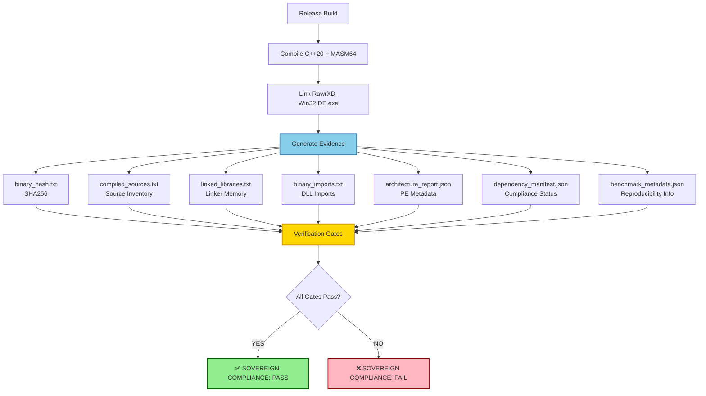
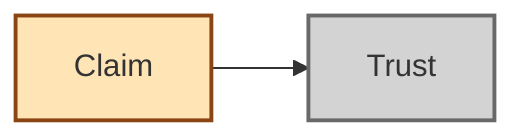
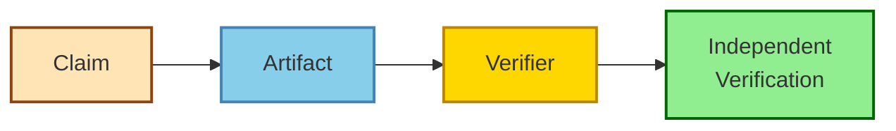
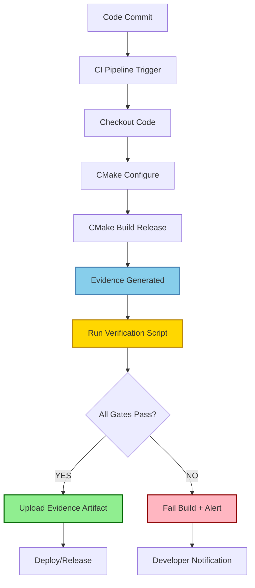
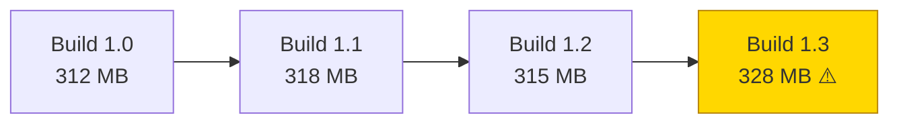
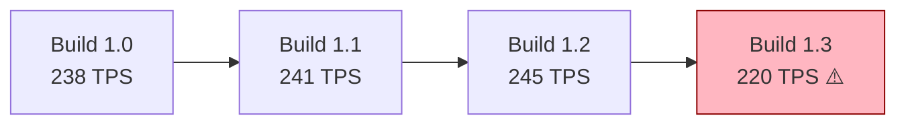
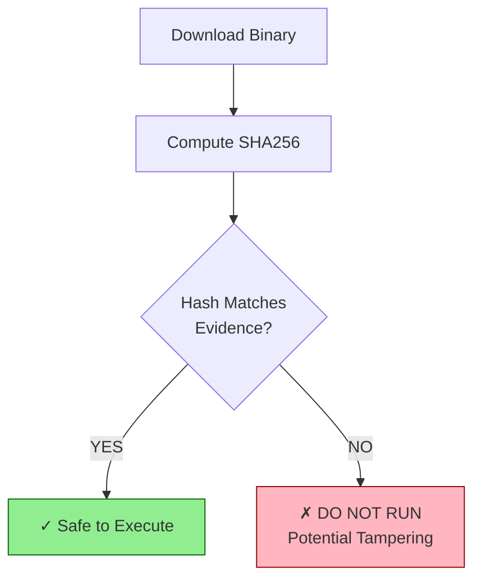
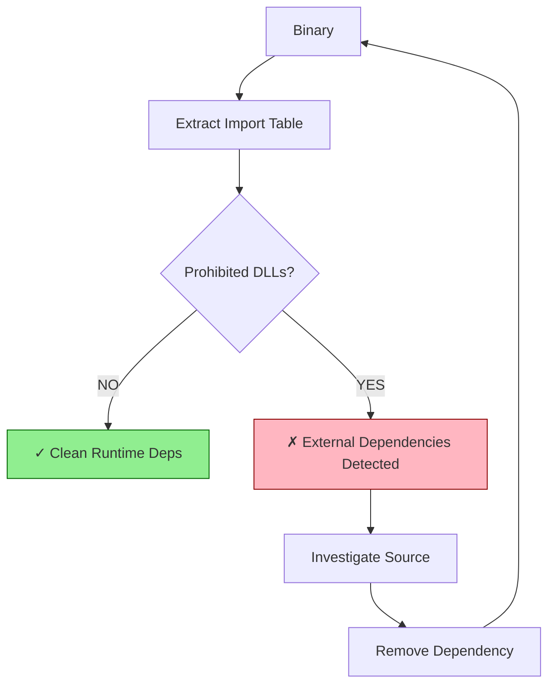

# RawrXD Sovereign Evidence Pipeline

## Pipeline Overview



---

## Evidence Chain of Custody

### Traditional Approach (Trust-Based)


### RawrXD Approach (Evidence-Based)


---

## Artifact Locations

```
build/
└── evidence/
    ├── binary_hash.txt              ← SHA256 hash
    ├── compiled_sources.txt         ← Source inventory
    ├── linked_libraries.txt         ← Linker memory
    ├── binary_imports.txt           ← DLL imports
    ├── architecture_report.json     ← PE metadata
    ├── dependency_manifest.json     ← Compliance status
    ├── benchmark_metadata.json      ← Benchmark info
    └── verification_report_*.md     ← Generated report (optional)
```

---

## Verification Gates Detail

```mermaid
graph TD
    subgraph "Gate 1: Binary Hash"
        A1[SHA256 Match?] -->|YES| A2[✓ Reproducibility]
        A1 -->|NO| A3[✗ Binary Modified]
    end
    
    subgraph "Gate 2: Source Inventory"
        B1[Integration Patterns?] -->|NO| B2[✓ Sovereign Naming]
        B1 -->|YES| B3[⚠ Review Files]
    end
    
    subgraph "Gate 3: Dependency Manifest"
        C1[Prohibited Deps?] -->|NO| C2[✓ Compliance PASS]
        C1 -->|YES| C3[✗ Compliance FAIL]
    end
    
    subgraph "Gate 4: Import Table"
        D1[Prohibited DLLs?] -->|NO| D2[✓ Clean Imports]
        D1 -->|YES| D3[✗ External DLLs]
    end
    
    subgraph "Gate 5: Architecture Report"
        E1[SHA256 Present?] -->|YES| E2[✓ Metadata Valid]
        E1 -->|NO| E3[✗ Report Incomplete]
    end
    
    subgraph "Gate 6: Benchmark Metadata"
        F1[Hardware Info?] -->|YES| F2[✓ Reproducible]
        F1 -->|NO| F3[⚠ Info Missing]
    end
    
    subgraph "Gate 7: Linked Libraries"
        G1[Prohibited Libs?] -->|NO| G2[✓ Clean Link]
        G1 -->|YES| G3[✗ External Libs]
    end
    
    style A2 fill:#90EE90,stroke:#006400
    style C2 fill:#90EE90,stroke:#006400
    style D2 fill:#90EE90,stroke:#006400
    style G2 fill:#90EE90,stroke:#006400
    style A3 fill:#FFB6C1,stroke:#8B0000
    style C3 fill:#FFB6C1,stroke:#8B0000
    style D3 fill:#FFB6C1,stroke:#8B0000
    style G3 fill:#FFB6C1,stroke:#8B0000
    style B3 fill:#FFD700,stroke:#B8860B
    style E3 fill:#FFB6C1,stroke:#8B0000
    style F3 fill:#FFD700,stroke:#B8860B
```



---

## CI/CD Integration Flow



---

## Evidence Verification Commands

### Quick Verification
```powershell
# Build
cmake --build build --config Release

# Verify
.\scripts\Verify-SovereignCompliance.ps1

# Check results
ls build\evidence\
```

### Individual Artifact Checks
```powershell
# 1. Verify binary hash
$stored = Get-Content build\evidence\binary_hash.txt
$computed = (Get-FileHash build\bin\RawrXD-Win32IDE.exe -Algorithm SHA256).Hash
$stored -eq $computed  # Should be True

# 2. Check dependency compliance
$manifest = Get-Content build\evidence\dependency_manifest.json | ConvertFrom-Json
$manifest.compliance_status  # Should be "PASS"

# 3. Count sovereign sources
$sources = Get-Content build\evidence\compiled_sources.txt | Where-Object { $_ -notmatch '^#' -and $_ -ne '' }
$sovereign = $sources | Where-Object { $_ -match 'sovereign_|native_|direct_' }
Write-Host "Sovereign: $($sovereign.Count) / $($sources.Count)"

# 4. Check for prohibited DLLs
$imports = Get-Content build\evidence\binary_imports.txt
if ($imports -match 'llama\.dll|ggml\.dll') {
    Write-Host "FAIL: External inference DLLs!" -ForegroundColor Red
} else {
    Write-Host "PASS: No prohibited DLLs" -ForegroundColor Green
}
```

---

## Sovereignty Claims → Evidence Mapping

| Claim | Evidence Artifact | Verification Gate |
|-------|------------------|-------------------|
| "Zero external inference frameworks" | `dependency_manifest.json` | Gate 3 |
| "No runtime dependencies on llama.cpp" | `binary_imports.txt` | Gate 4 |
| "100% sovereign implementation" | `compiled_sources.txt` | Gate 2 |
| "Reproducible builds" | `binary_hash.txt` | Gate 1 |
| "Complete source inventory" | `architecture_report.json` | Gate 5 |
| "Benchmark reproducibility" | `benchmark_metadata.json` | Gate 6 |
| "Clean linker memory" | `linked_libraries.txt` | Gate 7 |

---

## Performance Tracking

### Binary Size Over Time


### TPS Performance Over Time


---

## Security Considerations

### Hash Verification Before Execution


### Import Table Audit


---

## Archival Strategy

### Production Release Package
```
RawrXD-v1.0-Release/
├── RawrXD-Win32IDE.exe
├── SHA256SUMS.txt
├── evidence/
│   ├── binary_hash.txt
│   ├── compiled_sources.txt
│   ├── linked_libraries.txt
│   ├── binary_imports.txt
│   ├── architecture_report.json
│   ├── dependency_manifest.json
│   └── benchmark_metadata.json
├── verification_report.md
└── RELEASE_NOTES.md
```

### Archive Command
```powershell
# Create evidence package
$timestamp = Get-Date -Format 'yyyyMMdd_HHmmss'
$zipName = "RawrXD-Evidence-$timestamp.zip"
Compress-Archive -Path build\evidence\* -DestinationPath $zipName

# Include hash
$hash = Get-Content build\evidence\binary_hash.txt
Add-Content -Path "SHA256SUMS.txt" -Value "$hash  RawrXD-Win32IDE.exe"

Write-Host "Evidence package: $zipName"
Write-Host "SHA256: $hash"
```

---

## Related Documentation

- **Specification**: `SOVEREIGN_IMPLEMENTATION_STACK.md`
- **Engineering Review**: `SOVEREIGN_SPEC_REVIEW_SUMMARY.md`
- **Implementation**: `EVIDENCE_IMPLEMENTATION_SUMMARY.md`
- **Full Guide**: `docs/EVIDENCE_PIPELINE.md`
- **Quick Reference**: `docs/EVIDENCE_QUICK_REF.md`
- **Verification Script**: `scripts/Verify-SovereignCompliance.ps1`
- **CMake Configuration**: `CMakeLists.txt` (lines ~5080-5200)

---

*Pipeline Version: 1.0*  
*Last Updated: 2026-08-03*  
*Status: Implementation Complete, Awaiting Build Verification*
