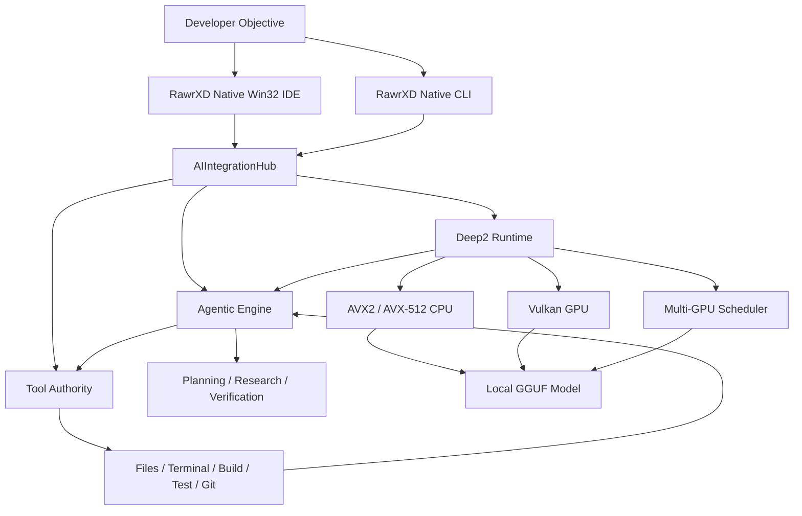
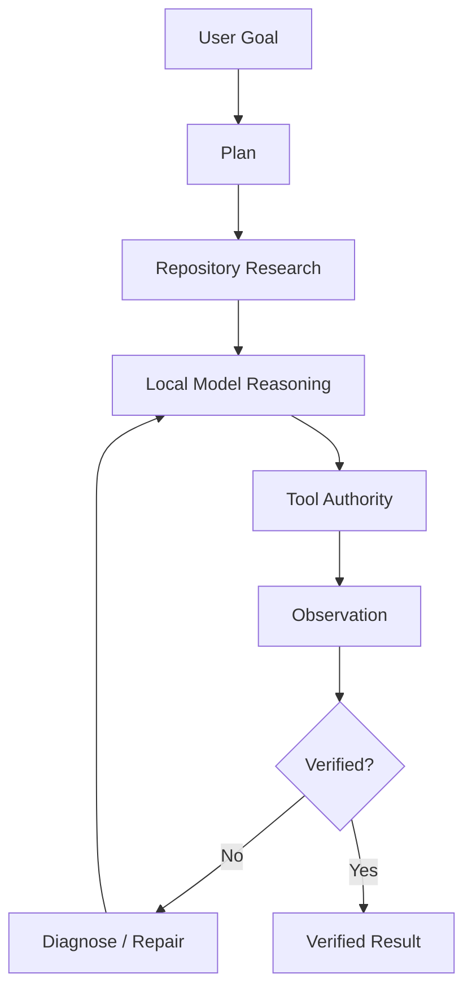
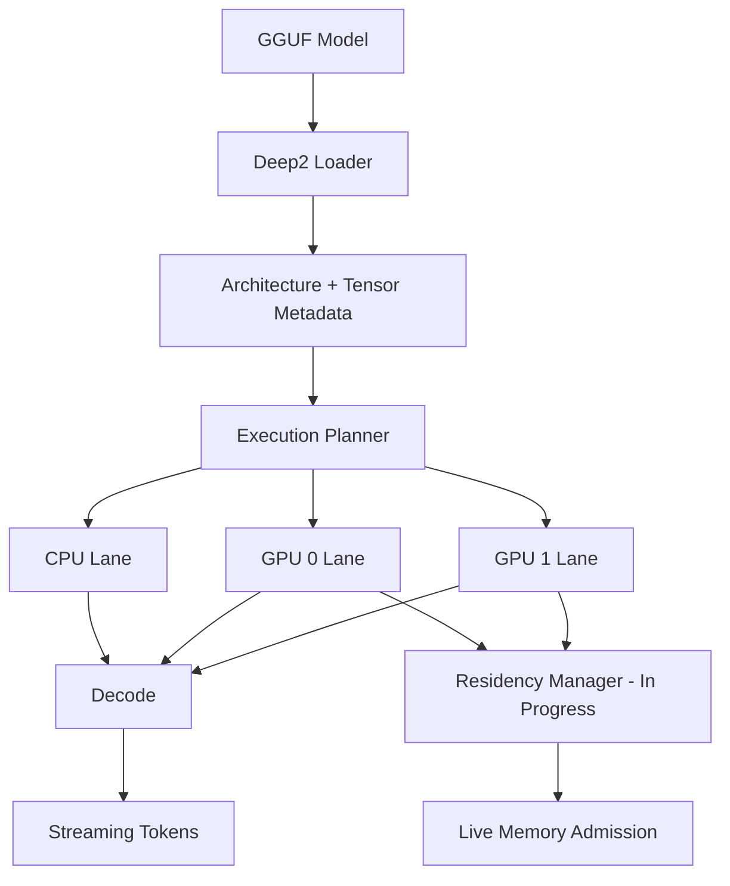

# RawrXD v3.0

## Native Agentic AI Development Environment
**Local Models · Native Inference · Autonomous Engineering · One Stack**

`Native Win32` · `C++20` · `Deep2` · `Vulkan` · `AVX2 / AVX-512` · `Multi-GPU Research` · `Local-First` · `MIT`

### Build. Run. Reason. Repair. Locally.

---

# Current Authority Snapshot
RawrXD v3 is under active end-to-end hardening.

The architecture is substantial and operational in multiple subsystems, but **architecture presence is not treated as product-path certification**.

```
IDE
  Native Win32 architecture             PRESENT
  Current production build              IN HARDENING
  Full product-path authority            NOT YET SEALED

Deep2
  Native GGUF loading                    PRESENT
  CPU token generation                   PASS
  Streaming decode                       PASS
  Vulkan infrastructure                  PRESENT
  GPU buffer / execution infrastructure  PRESENT
  Production weight residency            IN PROGRESS
  Dense GPU correctness                  IN CERTIFICATION
  MLA model admission                    PASS
  MLA token generation                   NOT YET PASS
  Oversized-model generation             NOT YET CERTIFIED

Agentic
  Repository research infrastructure     PRESENT
  Source modification infrastructure     PRESENT
  Build/test execution infrastructure    PRESENT
  Tool Authority                         INTEGRATION IN PROGRESS
  IDE / CLI / headless parity             IN PROGRESS
  Full autonomous recovery               NOT YET SEALED

Build
  rawr-server                             BUILDS / LINKS
  InferenceWire integration               LINK PROVEN
  Win32 IDE                               ACTIVE HARDENING
  Source-graph authority                  IN RECONCILIATION
```

RawrXD deliberately distinguishes:

```
PRESENT
    architecture or implementation exists

PASS
    relevant execution path has been exercised successfully

CERTIFIED
    result has reproducible evidence and appropriate receipts

IN PROGRESS
    implementation exists partially or remains under verification

NOT YET PASS
    required product behavior has not been demonstrated
```

A file existing does not prove reachability.

A target compiling does not prove runtime correctness.

A harness passing does not prove the product path.

---

# RawrXD
**RawrXD** is a native Windows development environment built around two ideas:

1. **AI agents should be able to actually engineer software—not merely suggest code.**
2. **The inference engine powering those agents should be locally controllable too.**

RawrXD combines:

- a native **C++20 / Win32 IDE**
- an autonomous **agentic software-engineering architecture**
- centralized **Tool Authority**
- the **Deep2 native inference runtime**
- direct local model execution
- native **Vulkan GPU compute infrastructure**
- AVX2 / AVX-512 CPU acceleration
- heterogeneous multi-GPU research
- repository-wide source research
- autonomous source modification infrastructure
- terminal and process control
- build and test execution
- Git workflows
- runtime diagnostics
- local API serving
- iterative engineering and recovery loops

All inside one native product stack.

**No Electron shell required.**

**No mandatory Qt runtime.**

**No required cloud inference service.**

**No requirement to route supported local models through Ollama.**

---

# The Idea
Most AI coding products begin with:

```
Editor
  +
AI Assistant
```

Most local model runtimes begin with:

```
Prompt
  ↓
Model
  ↓
Tokens
```

RawrXD is being built around the complete engineering loop:

```
Developer Objective
        ↓
Repository Research
        ↓
Planning
        ↓
Local Model
        ↓
Tool Execution
        ↓
Source Modification
        ↓
Build
        ↓
Test
        ↓
Observation
        ↓
Diagnosis
        ↓
Repair
        ↓
Verification
        ↓
Verified Result
```

The model is one component.

**The engineering system is the product.**

---

# One Native AI Stack

```
┌──────────────────────────────────────────────────────────────┐
│                         RawrXD IDE                           │
│                    Native C++20 / Win32                     │
├──────────────────────────────────────────────────────────────┤
│                     AIIntegrationHub                        │
├──────────────────────────────┬───────────────────────────────┤
│       Agentic Engine         │        Tool Authority         │
│                              │                               │
│  Planning                    │  Files                        │
│  Repository Research         │  Search                       │
│  Verification                │  Terminal                     │
│  Self-Correction             │  Processes                    │
│  Code Surgery                │  Build / Test                 │
│  Task Execution              │  Git                          │
│                              │  Diagnostics                  │
├──────────────────────────────┴───────────────────────────────┤
│                          Deep2                              │
│                 Native Local Inference Runtime              │
├───────────────────┬──────────────────┬───────────────────────┤
│ CPU Kernels       │ Vulkan Compute   │ Multi-GPU Research    │
│ AVX2 / AVX-512    │ GPU Execution    │ Admission / Routing   │
├───────────────────┴──────────────────┴───────────────────────┤
│                       Local GGUF Models                      │
└──────────────────────────────────────────────────────────────┘
```

---

# Why RawrXD Exists
Modern AI development tooling is powerful, but development environments and model runtimes are commonly separate systems.

RawrXD takes a different approach.

The editor, agent, execution authority, inference runtime, GPU infrastructure, diagnostics system, CLI, and local server are designed as parts of the same application architecture.

The target workflow is:

```
rawr run modelname audit my IDE codebase for any stubs
```

with an execution path resembling:

```
Resolve Model
     ↓
Load Through Deep2
     ↓
Open Repository
     ↓
Enumerate Source
     ↓
Research Implementations
     ↓
Find Stubs / Defects
     ↓
Build Repair Plan
     ↓
Modify Source
     ↓
Compile
     ↓
Run Tests
     ↓
Inspect Failures
     ↓
Repair
     ↓
Rebuild
     ↓
Verify
     ↓
Report
```

That complete path remains the primary v3 certification target.

---

# Evidence Discipline
RawrXD development follows a deliberately strict distinction between evidence classes.

```
MEASURED
    directly observed from a tool, binary, runtime, or artifact

HYPOTHESIS
    plausible explanation requiring further measurement

PASS
    relevant behavior was exercised successfully

UNVERIFIED
    assertion has not yet received sufficient evidence

RETRACTED
    evidence disproved an earlier assertion
```

A finding without file-and-line or runtime evidence remains a hypothesis.

A benchmark without enough provenance to reproduce it is not promoted as a performance guarantee.

---

# Native Agentic Engineering
RawrXD contains a native agent execution architecture for multi-step software-development work.

Its infrastructure provides or is being certified for:

- repository inspection
- source-tree traversal
- symbol and implementation search
- cross-file context gathering
- unfinished implementation discovery
- suspicious path detection
- repair planning
- source modification
- build execution
- test execution
- compiler-output inspection
- runtime-failure inspection
- corrective editing
- rebuild loops
- verification
- continued execution after recoverable failures

The objective is not simply code generation.

The objective is:

> **Closed-loop software engineering.**

Full product-path autonomous recovery remains under certification.

---

# Autonomous Planning
Large objectives can be decomposed into smaller executable operations.

```
User Objective
      ↓
Task Decomposition
      ↓
Repository Research
      ↓
Execution Plan
      ↓
Tool Selection
      ↓
Tool Calls
      ↓
Observations
      ↓
Verification
      ↓
Correction
      ↓
Next Action
```

The architecture is designed to allow engineering work to continue beyond a single model response.

---

# Deep Project Research
RawrXD's agent infrastructure can gather repository context while a task progresses.

Research operations include:

```
Directory Traversal
Source Inspection
Symbol Search
Configuration Discovery
Build-System Inspection
Implementation Tracing
Dependency Discovery
Stub Detection
Error-Path Analysis
Cross-File Context Gathering
```

Instead of requiring the entire repository to fit into one model prompt, context can be collected dynamically as the task advances.

---

# Self-Correcting Engineering
Generated code is not assumed correct.

The intended engineering loop is:

```
Generate
   ↓
Compile
   ↓
Test
   ↓
Observe
   ↓
Diagnose
   ↓
Repair
   ↓
Rebuild
   ↓
Verify
```

Compiler output, test failures, runtime diagnostics, and tool results become observations for the next engineering step.

A failed build is evidence.

It is not automatically the end of the task.

---

# Agent Tool Authority
Autonomous execution is designed to pass through RawrXD's native Tool Authority architecture.

```
                         Model
                           │
                           ▼
                     Agent Planner
                           │
                           ▼
                  Tool Authority Registry
                           │
            ┌──────────────┼──────────────┐
            │              │              │
            ▼              ▼              ▼
          Files         Terminal         Git
            │              │              │
       Search / Read   Build / Test     Status
       Write / Patch   Launch           Diff
       Enumerate       Inspect          Commit
            │              │              │
            └──────────────┼──────────────┘
                           │
                           ▼
                       Observation
                           │
                           ▼
                       Verification
                           │
                           ▼
                        Next Step
```

The authority layer is intended to provide one controlled execution boundary for:

- IDE agents
- CLI agents
- autonomous loops
- headless workflows
- code-repair systems
- repository audits

A chat panel can suggest that a command should run.

An engineering agent needs controlled authority to run it, inspect the result, and determine what happens next.

Unified IDE / CLI / headless Tool Authority remains under active integration.

---

# Agentic Models Without Native Tool Calls
RawrXD's agent architecture is not limited to models that natively emit structured tool calls.

The design includes **puppeteering and hotpatching layers** that can translate model output into controlled agent operations.

Conceptually:

```
Model
  ↓
Native Tool Call?
  ├── Yes → Tool Authority
  │
  └── No
       ↓
  Agent Puppeteering
       ↓
  Hotpatch / Protocol Adaptation
       ↓
  Structured Tool Intent
       ↓
  Tool Authority
       ↓
  Observation
       ↓
  Model Continuation
```

The purpose is to provide agentic behavior while preserving Tool Authority as the execution boundary.

This remains part of the broader product-path certification effort.

---

# Code Surgery
RawrXD includes targeted source-repair workflows through its native agent and patching infrastructure.

```
Locate Implementation
        ↓
Inspect Context
        ↓
Determine Minimal Change
        ↓
Patch
        ↓
Compile
        ↓
Test
        ↓
Verify
```

The design goal is focused, verifiable modification rather than uncontrolled repository-wide rewriting.

---

# Deep2 Native Inference Runtime
RawrXD includes its own inference runtime:

## Deep2
Deep2 is designed to execute supported local models directly rather than requiring an external inference server.

```
GGUF Model
    │
    ▼
Deep2 Loader
    │
    ├── Architecture Metadata
    ├── Tensor Metadata
    ├── Quantization Metadata
    └── Runtime Configuration
    │
    ▼
Execution Planning
    │
    ├── CPU
    ├── Vulkan GPU
    └── Multi-GPU
    │
    ▼
Decode
    │
    ▼
Streaming Tokens
    │
    ├── IDE
    ├── CLI
    ├── API
    └── Agent
```

Deep2 is not intended to be a thin wrapper around another model runner.

It is a native RawrXD subsystem.

---

# Current Deep2 Performance Reality
Performance claims are separated from architecture claims.

A current measured comparison exposed a major optimization deficit:

```
MODEL                         DECODE TOK/S

Ollama llama3.2:3b                177.17

Deep2
llama3.2-3b-Q2_K                    0.45
```

The measured ratio is approximately:

```
177.17 / 0.45 ≈ 394x
```

This is a real deficit.

It is **not** currently attributed to one proven subsystem.

Potential causes such as CPU feature probing, kernel dispatch, tensor conversion, memory movement, synchronization, and decode-loop structure must be measured rather than assumed.

The current performance task is therefore:

```
TOKEN_LOOP
KV_CACHE
Q_PROJECTION
K_PROJECTION
V_PROJECTION
ROPE
ATTENTION
FFN
SAMPLER
```

with absolute time per stage and a named denominator for every reported rate.

---

# Native GGUF Execution
Deep2 can inspect and execute supported GGUF models.

Metadata discovery includes:

```
Architecture
Layer Count
Hidden Size
Feed-Forward Size
Attention Heads
KV Heads
Vocabulary
Tensor Shapes
Tensor Types
Quantization Types
RoPE Metadata
Model Metadata
```

Supported execution remains local to the RawrXD runtime.

Availability depends on architecture, tensor type, quantization family, and backend correctness.

---

# Native Quantized Execution
Deep2 contains native work around GGUF quantization families including:

```
Q2_K
Q4_0
Q4_K
Q5_K
Q8_0
```

Exact support depends on model architecture, tensor type, and execution backend.

Quantized execution is being implemented inside Deep2 rather than requiring delegation to an external model server.

---

# CPU Acceleration
Deep2 contains hardware-aware CPU execution paths.

Native acceleration work includes:

- AVX2
- AVX-512
- FMA
- F16C
- VNNI-aware execution
- quantized GEMV
- quantized tensor execution
- runtime CPU feature detection
- hardware-specific kernel dispatch

```
Model Tensor
     ↓
Quantization Type
     ↓
Kernel Registry
     ↓
CPU Capability Detection
     ↓
Best Available Verified Native Path
```

Kernel availability is not equivalent to kernel reachability.

Runtime dispatch must be verified.

---

# CPU Dispatch Investigation
A current high-priority hypothesis concerns CPU feature probing and AVX-512 Q4_K GEMV dispatch.

That hypothesis is **not yet accepted as the sole cause of the full-model performance deficit**.

The required evidence is:

```
CPU_PROBE_EXECUTED=1
AVX512_DETECTED=1
Q4_K_AVX512_REGISTERED=1
Q4_K_AVX512_SELECTED=1
SCALAR_FALLBACKS=<measured>
TOKENS_DECODED=<measured>
DECODE_TPS=<measured>
```

Only then can performance attribution be promoted from hypothesis to measured cause.

---

# Vulkan GPU Compute
Deep2 includes native Vulkan compute infrastructure.

Implemented infrastructure includes work around:

- Vulkan physical-device enumeration
- compute queue discovery
- native buffer management
- device-local memory
- memory-type selection
- command buffers
- fences
- query infrastructure
- quantized GPU kernels
- persistent GPU resources
- asynchronous submission
- live memory-budget inspection
- decode telemetry
- multi-device execution infrastructure

The objective is direct control over the accelerator rather than proxying inference through another runtime.

---

# GPU Weight Residency Status
Vulkan infrastructure is **not the same thing as production weight residency**.

A critical measured failure demonstrated this distinction.

Enabling GPU execution made GEMV paths eligible while the required model weights were not resident in a usable GPU representation.

Under strict execution policy:

```
GPU path becomes eligible
        ↓
weight view unavailable
        ↓
GPU execution cannot proceed
        ↓
strict mode forbids silent CPU fallback
```

The correct solution is not another enable flag.

It is a production residency pipeline:

```
Tensor Required
      ↓
Residency Lookup
      ↓
Not Resident?
      ↓
Host Source / Window
      ↓
Decode / Transform
      ↓
Staging Buffer
      ↓
Device Allocation
      ↓
Host → Device Transfer
      ↓
Fence / Visibility
      ↓
Resident GPU View
      ↓
Kernel Dispatch
```

Current status:

```
Vulkan device infrastructure          PRESENT
GPU buffers                           PRESENT
GPU execution infrastructure         PRESENT
Live budget inspection               PRESENT
Production weight residency          IN PROGRESS
Residency-backed dense GPU decode     NOT YET SEALED
```

---

# Live VRAM Budget Awareness
GPU memory availability is not treated as a static constant.

Deep2 contains infrastructure for reasoning about Vulkan heap state:

```
Physical GPU
     ↓
Vulkan Heap
     ↓
Live Budget
     ↓
Current Usage
     ↓
Reserved Headroom
     ↓
Admission Decision
```

This is a foundation for safe GPU admission.

Live-budget support alone does not prove successful weight residency.

---

# MLA Status
Deep2 has reached a real MLA admission milestone.

Measured state includes:

```
MODEL_ADMITTED=1
MLA_LAYERS_BOUND=61/61
GEOMETRY_VALIDATED=1
FORWARD_REACHED=1
```

Relevant geometry measured for the tested architecture includes:

```
KV_LORA_RANK=512
Q_LORA_RANK=1536
QK_NOPE=512
QK_ROPE=64
KEY_LEN=576
VALUE_LEN=512
```

However:

```
TOKENS_FROM_KIMI=0
```

Therefore:

```
MLA_ADMISSION=PASS
MLA_BINDING=PASS
MLA_GENERATION=NOT_YET_PASS
```

Admission must not be represented as successful model generation.

---

# Residencyless Model Access
Deep2 is developing a model-access architecture in which model size does not directly determine required process residency.

Instead of requiring a complete model or tensor to remain mapped and resident, model data can be addressed through bounded windows:

```
Model
  ↓
Tensor Manifest
  ↓
Requested Tensor / Expert Range
  ↓
Bounded File View
  ↓
Decode / Transform / Execute
  ↓
Release View
```

A Beacon certification run on:

```
DeepSeek-V2-Lite-Chat.Q4_K_M.gguf
```

measured:

```
Model size        10,364,416,768 bytes
Tensor count      377
Traversal         99.96% of file
Traversal order   shuffled
```

Measured comparison:

```
Whole-file mapped view:
    peak process working set      9883.91 MB

Windowed mapped views:
    peak process working set         3.99 MB
    maximum mapped view              0.56 MB
    private-memory delta             0.059 MB
```

Measured conclusions:

```
WHOLE_MODEL_VIEW_REQUIRED=0
WHOLE_MODEL_PRIVATE_COPY=0
BYTE_IDENTITY_PRESERVED=1
```

This establishes a host-side substrate where:

```
Model Size ≠ Required Whole-Model Process Residency
```

**This is host-side evidence.**

It does not prove complete GPU inference directly from this representation.

---

# Loadless Beacon Model Server
The Beacon model server exposes model metadata and byte-addressable ranges without requiring the entire model to be privately materialized.

Interfaces include:

```
GET /v1/models
GET /health
GET /models/<id>/manifest
GET /models/<id>/blob?off=<offset>&len=<length>
```

Range responses use partial-content semantics and can be verified byte-for-byte against the source model.

The manifest can expose fields such as:

```
elements
block_bytes
type_name
layer
expert
role
```

allowing execution logic to resolve:

```
Model → Layer → Tensor → Expert → Byte Range
```

without treating the model as one monolithic load operation.

---

# Execution Aperture
The longer-term Deep2 architecture uses a bounded execution aperture:

```
Large Model Source
       ↓
Selected Range
       ↓
Small Mapped Window
       ↓
Kernel-Sized Decode / Execution Tile
       ↓
Accumulator
       ↓
Release
```

The objective is for memory requirements to scale primarily with the active execution window rather than total model size.

Host-side bounded mapping is measured.

Complete direct GPU execution from this representation remains under correctness and performance certification.

---

# Experimental — Decoda Execution Representation
**Certification status, not production capability.**

Decoda is RawrXD's compressed-weight execution research track.

## Serialized Size
Measured on one `256 × 1408` expert slice of:

```
blk.9.ffn_gate_exps.weight
```

Receipt:

```
RAWRXD_V6_BITACCOUNT_006
```

Measured encoder accounting:

```
V6_TOTAL_BPW          = 4.1557
Q4_K_SOURCE_BPW       = 4.5000
V6_VERSUS_Q4K         = 0.923x
COMPRESSION_GAIN      = 7.65%

MEAN_M                = 2.66193
MEAN_RESIDUAL_BPW     = 2.66193
LLOYD_CENTROID_BPW    = 1.1532
```

The original design target was `3.125 bpw`.

That figure is **not** presented as achieved.

The measured encoder result is `4.1557 bpw`.

---

## Residual Kernel Parity
Receipt:

```
RAWRXD_V6_KERNEL_PARITY_007
```

`Dot2/3/4_256` was compared against an independent scalar dot over the packed-block reconstruction.

Measured results:

```
M2_TESTED = 720
M2_FAILURES = 0

M3_TESTED = 1075
M3_FAILURES = 0

M4_TESTED = 3165
M4_FAILURES = 0

TOTAL = 4960
TOTAL_FAILURES = 0

KERNEL_NAN = 0

VERDICT = PARITY=PASS
```

Reference contract:

```
REFERENCE_CONTRACT=RESIDUAL_ONLY
```

These kernels compute the residual contribution described by their contract.

They are not claimed to represent a complete full-weight execution path.

---

## Decoda Open Gates

```
M0_KERNEL                 = MISSING
M1_KERNEL                 = MISSING
M0–M4_COMPLETE_PARITY     = NOT_YET_RUN
DCB6_SIDECAR              = NOT_CANONICAL
V6_EXECUTION_BPW          = UNMEASURED
ZERO_RUNTIME_V6_ENCODE     = NOT_DEMO
DIRECT_DCB6_EXECUTION      = NOT_YET_CERTIFIED
```

M0 and M1 remain meaningful because they represent a substantial portion of the allocation census.

No production-completeness claim is made until those execution classes and full parity are closed.

---

# Heterogeneous Multi-GPU Compute
RawrXD is designed to coordinate different GPU models.

The scheduler does not assume that every device has:

- identical VRAM
- identical compute capability
- identical memory bandwidth
- identical architecture
- identical optimal workload share

Target architecture:

```
                       Decode Work
                           │
                           ▼
                     Adaptive Scheduler
                           │
                     ┌─────┴─────┐
                     │           │
                     ▼           ▼
                   GPU 0       GPU 1
                Larger/Faster  Smaller/Slower
                     │           │
                     └─────┬─────┘
                           ▼
                     Combined Result
```

Runtime work includes:

- device-specific execution lanes
- adaptive workload splitting
- residency-aware routing
- live admission decisions
- device-specific ratios
- GPU timing telemetry
- strict execution validation
- fallback detection
- cross-device scheduling

Current measured hardware work has also established that heterogeneous devices cannot simply be assumed to support direct peer handoff.

Therefore:

**Heterogeneous multi-GPU infrastructure exists, but production performance and peer-transfer guarantees are not implied.**

---

# Local-First by Design
The core RawrXD engineering loop is designed to work locally.

```
Your Repository
      +
Your Local Model
      +
Your Hardware
      ↓
RawrXD
      ↓
Research
      ↓
Plan
      ↓
Modify
      ↓
Compile
      ↓
Test
      ↓
Repair
      ↓
Verify
```

A remote inference API is not required for supported native local workflows.

---

# No Mandatory Ollama Runtime
RawrXD can execute supported models through Deep2.

External-runtime path:

```
IDE
 ↓
External Model Server
 ↓
Model
```

RawrXD native path:

```
RawrXD
   ↓
Deep2
   ↓
Model
```

Compatibility interfaces can still exist where useful.

Deep2 is intended to remain an independent runtime rather than making RawrXD dependent on another model runner.

Ollama is also useful as an external performance comparison when evaluating Deep2.

It is not the target inference dependency.

---

# Native Win32 IDE
RawrXD v3 uses a native Windows product architecture.

Primary technologies include:

```
C++20
Win32
Windows Native APIs
Winsock
WinHTTP
Vulkan
Native Threads
Native Process Management
Native File I/O
Native Memory Management
```

The v3 architecture does not require Qt as its primary UI/runtime layer.

---

# Native IDE Status
The Win32 IDE architecture is real, but the complete current product build remains under hardening.

Known implementation work has included issues such as:

```
incorrect internal header paths
missing standard-library includes
stale self-include paths
API drift
unresolved linker symbols
source-graph inconsistencies
```

These are treated as build and integration defects, not reasons to redefine incomplete behavior as complete.

The IDE reaches `PASS` only when the current source tree:

```
CONFIGURES
COMPILES
LINKS
LAUNCHES
EXECUTES PRODUCT COMMANDS
REACHES DEEP2
REACHES TOOL AUTHORITY
SURVIVES END-TO-END CERTIFICATION
```

---

# Source-Graph Authority
RawrXD contains a large CMake build graph.

Historical source counts became contradictory enough that raw regex counts are **not currently treated as authoritative**.

The project is establishing:

```
RAWRXD_SOURCE_GRAPH_AUTHORITY_001
```

Required conditions include:

```
PARSER_DETERMINISTIC=PASS
TREE_UNCHANGED_BETWEEN_RUNS=PASS
RESOLVED_SET_IDENTICAL=PASS
RECONFIGURE_REPEATABILITY=PASS
GENERATED_GRAPH_CROSSCHECK=PASS
COMPILE_DB_CROSSCHECK=PASS
UNEXPLAINED_COUNT_DIFFERENCES=0
UNKNOWN=0
VERDICT=PASS
```

The authoritative graph must distinguish:

```
literal source paths
quoted paths
unquoted paths
variable expansion
generator expressions
globs
comments
generated files
conditional branches
target membership
filtered sources
platform exclusions
object libraries
header-only inputs
```

Until that authority gate passes, historical missing-source totals are not promoted as current facts.

---

# Build-Graph Reachability
RawrXD treats **source existence** and **source reachability** as different properties.

A committed `.cpp` can exist and still be absent from every production target.

A recent high-leverage example was:

```
src/deep2/InferenceWire.cpp
```

which contains the implementation of:

```
Wire::WireRecordDispatch
```

The build integration has since been repaired across the relevant Deep2 target set, and an inference certification binary successfully linked.

Current rule:

```
SOURCE_EXISTS=1
    does not imply
SOURCE_COMPILED=1

SOURCE_COMPILED=1
    does not imply
PRODUCT_PATH_REACHES_SOURCE=1
```

Build-graph reachability is therefore treated as a first-class certification concern.

---

# Why Native?
RawrXD is built around direct control of the machine.

Native architecture gives the product direct access to:

- process creation and control
- filesystem APIs
- memory mapping
- explicit memory management
- GPU discovery
- Vulkan resources
- terminal processes
- build systems
- executable management
- local model memory
- low-level performance telemetry

That matters when the IDE, agent system, and inference runtime belong to the same product.

---

# AIIntegrationHub
`AIIntegrationHub` connects RawrXD's major product subsystems.

```
                         RawrXD IDE
                             │
                             ▼
                      AIIntegrationHub
                             │
             ┌───────────────┼───────────────┐
             │               │               │
             ▼               ▼               ▼
       Agentic Engine      Deep2        Tool Authority
             │               │               │
             ▼               ▼               ▼
         Planning         Local Models       Files
         Research         CPU Compute        Terminal
         Verification     Vulkan Compute     Build/Test
         Correction       Streaming          Git
```

The hub is intended to keep model execution, agent reasoning, and tool execution connected through native product paths.

---

# RawrXD vs. Other AI Development Stacks

> This table compares **architecture and product scope**, not model intelligence, benchmark quality, market maturity, or overall product quality.

| Capability | RawrXD | Cursor | VS Code + Copilot | Ollama | LM Studio |
|---|---|---|---|---|---|
| Code editor / IDE | Native Win32 IDE | Integrated editor | Host IDE | No | No |
| Autonomous coding architecture | Native agent architecture | Built in | Built in | External | External |
| Integration dependent | — | — | — | Yes | Yes |
| Multi-file editing | Yes / certification ongoing | Yes | Yes | External | External |
| Terminal / command execution | Tool Authority architecture | Agent tools | Agent tools | External | External |
| Integration dependent | — | — | — | Yes | Yes |
| Build / test feedback loop | Native execution architecture | Agent workflow | Agent workflow | External | External |
| Integration dependent | — | — | — | Yes | Yes |
| Repository research | Native agent research | Yes | Yes | External | External |
| Integration dependent | — | — | — | Yes | Yes |
| Built-in local inference runtime | Deep2 | Not core | Not core | Yes | Yes |
| Offline local execution | Core design | Not core architecture | Not core architecture | Yes | Yes |
| Native GPU compute subsystem | Deep2 Vulkan | Not core | Not core | Runtime responsibility | Runtime responsibility |
| Heterogeneous GPU scheduling | Active work | Not core | Not core | Runtime-specific | Runtime-specific |
| Live GPU budget telemetry | Deep2 infrastructure | Not core | Not core | Runtime-specific | Runtime-specific |
| Local API server | Native server | Not primary role | Not primary role | Yes | Yes |
| Editor + agent + owned inference runtime | Target architecture | Editor + agent | IDE + service | Runtime | Runtime / model app |
| Native Windows-first architecture | Yes | Cross-platform | Cross-platform | Cross-platform | Cross-platform |
| Controlled agent tool boundary | Tool Authority | Agent tool system | Agent tool system | External agent | Integration dependent |

RawrXD overlaps several categories:

```
IDE
+
Coding Agent
+
Tool Execution Layer
+
Local Model Runtime
+
GPU Runtime
+
Local API
```

That combination is the architectural differentiator.

---

# Performance Philosophy
RawrXD deliberately separates different kinds of performance measurement.

```
Kernel Benchmark
      ≠
Primitive Benchmark
      ≠
Abbreviated Runtime
      ≠
Full-Model Decode
      ≠
Real Token Streaming
      ≠
Agentic Product Execution
```

A fast isolated kernel does not mean the complete model runs at that rate.

A synthetic batching result is not presented as real-model decode performance.

---

# Evidence Before Promotion
A Deep2 optimization should progress through increasingly authoritative evidence.

```
Source Change
    ↓
Clean Build
    ↓
Kernel Test
    ↓
Primitive Test
    ↓
Runtime Test
    ↓
Model Load
    ↓
Token Decode
    ↓
Streaming
    ↓
Repeatability
    ↓
Product Path
    ↓
PROMOTION
```

Typical authority markers include:

```
MODEL_LOAD=PASS
TOKEN_DECODE=PASS
STREAMING=PASS
STRICT_GPU_VIOLATIONS=0
UNPLANNED_FALLBACKS=0
TOOL_AUTHORITY=PASS
AGENT_LOOP=PASS
BUILD_EXECUTION=PASS
TEST_EXECUTION=PASS
PRODUCT_PATH=PASS
```

The distinction is intentional:

```
"The code compiled"
        ≠
"The harness worked"
        ≠
"The subsystem worked"
        ≠
"The real product path worked"
```

---

# Performance Receipts
Performance claims should carry enough context to understand and reproduce them.

A receipt should identify:

```
Model
Model Hash
Quantization
Architecture

CPU
GPU(s)
RAM

Runtime Revision
Binary Hash

Prompt Token Count
Decode Token Count

Backend
Device Split

Fallback State
Strict-Violation Count

Decode TPS
Token Latency
Wall Time

Verdict
```

A benchmark value without sufficient provenance should be treated as historical or provisional rather than sealed.

---

# Runtime Telemetry
Deep2 exposes runtime diagnostics for debugging and certification.

Telemetry can include:

```
Decode TPS
Prompt Processing
Token Latency

GPU Compute Time
GPU Idle Time
Device Work Split
Queue Activity

Heap Budget
Heap Usage
Memory Headroom
Weight Residency
Admission Failures

Cache Statistics
GPU Fallbacks
CPU Fallbacks
Strict GPU Violations

Decode Synchronization
Execution-Lane State
```

Runtime telemetry is treated as part of correctness.

It is not merely a benchmark display.

---

# Streamer Telemetry
Current streamer telemetry uses a persistent JSONL sink so completed records can survive abnormal process termination.

Target properties include:

```
append record
fflush
_commit
binary image hash
run identity
runtime result
```

Known semantics still requiring hardening include:

```
decode-only TPS separation
child-process telemetry emission
consistent product-path receipt generation
```

Console output alone is not sufficient authority.

---

# Native Interactive CLI
RawrXD includes a native command-line application.

Example interface:

```
rawrxd_cli.exe
```

The CLI exposes model, agent, patching, diagnostic, and runtime functionality.

---

## Load a Model

```
/load <path>
```

Example:

```
/load F:\models\Qwen2.5-Coder-32B-Instruct-Q4_K_M.gguf
```

---

## Run an Agent Task

```
/agent <query>
```

Example:

```
/agent audit this repository for unfinished implementations
```

---

## Patch a Target

```
/patch <target>
```

Used for targeted source and code-surgery workflows.

---

## Generate Diagnostics

```
/bugreport
```

Used to launch native correctness, optimization, and issue-analysis workflows.

---

# Target Autonomous CLI Workflow
The intended high-level command is:

```
rawr run qwen2.5-coder audit my IDE codebase for any stubs
```

Conceptually:

```
 1. Resolve requested local model
 2. Load model through Deep2
 3. Resolve repository
 4. Enumerate project source
 5. Search for placeholders and stubs
 6. Inspect suspicious implementations
 7. Gather cross-file context
 8. Rank defects
 9. Construct repair plan
10. Modify source
11. Build affected targets
12. Run tests
13. Inspect compiler/runtime output
14. Diagnose failures
15. Repair defects
16. Rebuild
17. Re-test
18. Verify result
19. Report changed files
20. Produce final evidence
```

That is the primary end-to-end product path RawrXD v3 is being built to certify.

---

# Native Local API
RawrXD includes native networking infrastructure for exposing local AI functionality.

Potential clients include:

- RawrXD IDE
- RawrXD CLI
- local scripts
- automation systems
- OpenAI-style local clients
- Ollama-style compatibility clients
- third-party development tools

Architecture:

```
Client
  │
  ▼
Native HTTP Interface
  │
  ▼
AIIntegrationHub
  │
  ├── Agent Request
  │
  └── Inference Request
          │
          ▼
        Deep2
          │
          ▼
      Local Model
```

No external web framework is required by the core native server architecture.

---

# RawrXD Architecture



---

# Agent Execution Architecture



---

# Deep2 Execution Architecture



---

# Repository Structure
A simplified view:

```
RawrXD/
│
├── src/
│   │
│   ├── Native Win32 IDE
│   │
│   ├── AIIntegrationHub.*
│   │
│   ├── agentic_engine.*
│   │
│   ├── AgentHotPatcher.*
│   │
│   ├── FileOps.*
│   │
│   ├── Tool Authority
│   │
│   └── deep2/
│       │
│       ├── Deep2Engine*
│       ├── InferenceWire*
│       ├── vulkan_compute.*
│       ├── GGUF loader
│       ├── CPU kernels
│       ├── AVX2 / AVX-512
│       ├── quantized kernels
│       ├── Vulkan compute
│       ├── residency infrastructure
│       ├── memory admission
│       ├── multi-GPU scheduling
│       └── streaming decode
│
├── tests/
│
├── evidence/
│
├── tools/
│
├── CMakeLists.txt
│
└── README.md
```

Actual layout may evolve while v3 hardening continues.

---

# Build

## Requirements
Recommended development environment:

- Windows 11 x64
- Visual Studio 2022
- MSVC with C++20 support
- Windows SDK
- CMake 3.20+
- Vulkan SDK for Vulkan-enabled builds
- AVX2-capable CPU
- AVX-512-capable CPU for AVX-512 paths
- Vulkan-capable GPU for GPU execution

---

## Clone

```
git clone https://github.com/ItsMehRAWRXD/RawrXD.git
cd RawrXD
```

---

## Configure Native Build

```
mkdir build_native
cd build_native

cmake .. `
    -DENABLE_QT=OFF `
    -DUSE_AVX512=ON `
    -DRAWRXD_BUILD_CLI=ON
```

Exact options may change as the v3 build graph is consolidated.

---

## Build Release

```
cmake --build . --config Release
```

A successful build alone is not considered product certification.

---

# Example Local Workflow
Load a coding model:

```
/load F:\models\Qwen2.5-Coder-32B-Instruct-Q4_K_M.gguf
```

Run a repository audit:

```
/agent audit my IDE codebase for any stubs
```

Intended loop:

```
Search
  ↓
Inspect
  ↓
Reason
  ↓
Patch
  ↓
Build
  ↓
Test
  ↓
Repair
  ↓
Verify
```

---

# v2 → v3
RawrXD v3 represents a transition toward a unified native product architecture.

## Native UI
Legacy Qt-oriented product paths are being replaced by the native Win32 application architecture.

## Native Agent Execution
Simulation-style agent paths are being replaced by execution through centralized Tool Authority.

## Native Model Runtime
Deep2 moves local inference into the RawrXD stack itself.

## Native Tooling
File, terminal, process, build, test, Git, patching, and diagnostic operations are being unified behind native product infrastructure.

---

# Development Principles

## Local First
The core model and engineering workflow should remain capable of operating locally.

## Native First
Prefer direct platform APIs and source-controlled implementations where they materially improve control over the product.

## Evidence First
A successful build is not sufficient evidence to promote an implementation.

Verify the actual execution path.

## Real Models
Runtime work should ultimately be validated through complete model execution.

## No Silent Fallbacks
Fallback behavior should be observable.

## Authority Before Autonomy
An autonomous engineering agent requires a controlled and testable execution boundary.

## Correctness Before Performance Claims
A fast broken implementation is not a performance improvement.

## Product Path Over Harness Path
A subsystem is not fully integrated until the actual IDE, CLI, server, or autonomous product path reaches it.

## No Stub Promotion
Empty translation units, hardcoded-success returns, simulated output, and placeholder implementations do not count as functional completion.

## Retract Wrong Claims
When evidence disproves a hypothesis, the old claim should be explicitly withdrawn instead of silently surviving in project lore.

---

# v3 Certification Roadmap

## Foundation

- Native C++20 / Win32 architecture
- Native CLI infrastructure
- AIIntegrationHub architecture
- Deep2 model-loading infrastructure
- Native CPU inference paths
- Vulkan compute infrastructure
- Streaming decode infrastructure
- Runtime telemetry infrastructure
- InferenceWire link integration demonstrated
- Clean-build preservation across the consolidated production graph

---

## Agentic Layer

- Repository research infrastructure
- Source modification infrastructure
- Build/test execution infrastructure
- Native patching infrastructure
- Puppeteering / hotpatch architecture for non-tool-native models
- Unified Tool Authority across every autonomous path
- IDE / CLI / headless authority parity
- Full autonomous recovery certification
- Product-path agentic certification

---

## Source Graph

- Deterministic CMake source census
- Generated build-graph cross-check
- `compile_commands.json` cross-check
- Zero unexplained source-set differences
- `UNKNOWN=0`
- `RAWRXD_SOURCE_GRAPH_AUTHORITY_001=PASS`

No historical missing-source count should be considered authoritative until this gate is sealed.

---

## Residencyless Model Access

- Byte-addressable model manifest
- Byte-exact partial model serving
- Bounded host-side window mapping
- Model-size-independent host process residency substrate
- Kernel-sized transform scratch
- Hostile-order shuffled traversal certification
- Production GPU execution directly from bounded residency windows
- End-to-end oversized-model generation certification

---

## Decoda Execution Representation

- M2/M3/M4 residual kernel execution
- M2/M3/M4 zero-failure residual parity
- Serialized-size accounting
- M0 execution kernel
- M1 execution kernel
- M0–M4 complete parity
- Canonical DCB6 execution image
- Zero runtime V6 encoding
- Direct DCB6 streamed execution
- End-to-end model-quality certification

---

## Deep2 Runtime

- GGUF metadata discovery
- Quantized CPU execution infrastructure
- Native Vulkan infrastructure
- Live Vulkan memory-budget inspection
- Heterogeneous device discovery
- MLA architecture admission
- Production weight-residency pipeline
- Residency-backed GPU GEMV certification
- GPU execution aperture from bounded views
- Multi-GPU admission hardening
- Whole-model residencyless generation
- Decode-path optimization
- Repeatable full-model performance certification
- MLA token generation certification
- Oversized-model certification

---

## Product Authority

- Complete IDE agent path
- Complete CLI agent path
- Complete headless agent path
- Unified model → planner → tool → observation loop
- End-to-end stub audit
- Seal `rawr run <model> audit my IDE codebase for any stubs`
- v3 release-candidate authority gate

---

# Current v3 Engineering Status
RawrXD v3 is under active end-to-end hardening and certification.

Major architecture exists across:

- native Win32 application infrastructure
- local model loading
- CPU inference
- Vulkan compute
- streaming decode
- native CLI
- agent execution infrastructure
- repository research
- source modification
- build and test automation
- runtime diagnostics
- tool-routing infrastructure
- bounded model-file access
- experimental compressed execution

Current work remains focused on:

- deterministic source-graph authority
- Win32 IDE build closure
- Deep2 decode optimization
- CPU dispatch verification
- production GPU residency
- dense GPU correctness
- heterogeneous multi-GPU hardening
- MLA generation
- unified Tool Authority
- IDE / CLI / headless execution parity
- autonomous end-to-end certification

RawrXD intentionally favors measurable evidence over unsupported completion or performance claims.

---

# What "v3 Complete" Means
RawrXD v3 is not considered complete because the IDE opens.

It is not considered complete merely because a model generates tokens.

It is not considered complete merely because a harness passes.

The target completion command is:

```
rawr run modelname audit my IDE codebase for any stubs
```

with a result resembling:

```
MODEL_RESOLUTION=PASS
MODEL_LOAD=PASS

REPOSITORY_OPEN=PASS
SOURCE_ENUMERATION=PASS

RESEARCH=PASS
STUB_DETECTION=PASS
PLANNING=PASS

TOOL_AUTHORITY=PASS
SOURCE_EDIT=PASS

BUILD_EXECUTION=PASS
TEST_EXECUTION=PASS

ERROR_RECOVERY=PASS
REBUILD=PASS
VERIFICATION=PASS

FINAL_REPORT=PASS
PRODUCT_PATH=PASS
```

without a hidden simulation layer producing the result.

---

# Consolidated Release Authority
The final v3 authority gate should combine the major subsystems instead of accumulating disconnected component PASSes.

Conceptually:

```
SOURCE_GRAPH=PASS

IDE_CONFIGURE=PASS
IDE_COMPILE=PASS
IDE_LINK=PASS
IDE_LAUNCH=PASS

MODEL_LOAD=PASS
CPU_INFERENCE=PASS
GPU_CORRECTNESS=PASS
STREAMING=PASS

TOOL_AUTHORITY=PASS
AGENT_LOOP=PASS
SOURCE_EDIT=PASS

BUILD_EXECUTION=PASS
TEST_EXECUTION=PASS
ERROR_RECOVERY=PASS

NO_REQUIRED_STUBS=PASS
NO_SILENT_FALLBACKS=PASS
NO_SYNTHETIC_SUCCESS=PASS

PRODUCT_PATH=PASS
```

That is the standard for calling the system complete.

---

# Suggested Demo
The strongest RawrXD v3 demonstration is not a canned chat response.

Record:

```
rawr run qwen2.5-coder audit my IDE codebase for any stubs
```

Then show:

```
 1. Model loads locally.
 2. Repository enumeration begins.
 3. Tool Authority logs each operation.
 4. Agent finds a real incomplete implementation.
 5. Agent opens surrounding source.
 6. Agent constructs a minimal repair.
 7. Source changes appear in the IDE.
 8. Build launches.
 9. Failure is detected.
10. Agent diagnoses it.
11. Agent patches again.
12. Build passes.
13. Tests pass.
14. Git diff is displayed.
15. Authority receipt is emitted.
```

One successful end-to-end demonstration communicates the project more clearly than isolated component benchmarks.

---

# Performance Receipt Template
When publishing a result, use a receipt containing enough information to reproduce it.

```
RAWRXD_DEEP2_RECEIPT

RECEIPT_ID=

MODEL=
MODEL_SHA256=
QUANT=
ARCH=

CPU=
GPU0=
GPU1=
RAM=

COMMIT=
BINARY_SHA256=
BUILD=

PROMPT_TOKENS=
DECODE_TOKENS=

BACKEND=
DEVICE_SPLIT=

WARMUP=
RUNS=

PREFILL_TPS=
DECODE_TPS=

P50_TOKEN_MS=
P95_TOKEN_MS=

GPU_FALLBACKS=
CPU_FALLBACKS=
STRICT_GPU_VIOLATIONS=

WALL_TIME=
RAW_EXIT_CODE=

MEASURED=
HYPOTHESIS=
RETRACTED=

VERDICT=
```

This keeps benchmark claims independently understandable and easier to reproduce.

---

# Engineering Receipt Template
For build and product-path work:

```
RAWRXD_ENGINEERING_RECEIPT

RECEIPT_ID=

GIT_HEAD=
GIT_STATUS_HASH=
CMAKELISTS_SHA256=
SOURCE_TREE_MANIFEST_SHA256=

TARGET=
CONFIGURE=
COMPILE=
LINK=
LAUNCH=

PRODUCT_PATH_REACHED=
TESTS_RUN=
TESTS_PASSED=

RAW_EXIT_CODE=
BINARY_SHA256=

FILES_CHANGED=

MEASURED=
HYPOTHESIS=
RETRACTED=

VERDICT=
```

---

# Source-Graph Authority Template

```
=== RAWRXD_SOURCE_GRAPH_AUTHORITY_001 ===

GIT_HEAD=
GIT_STATUS_HASH=
CMAKELISTS_SHA256=
SOURCE_TREE_MANIFEST_SHA256=

PARSER_DETERMINISTIC=
TREE_UNCHANGED_BETWEEN_RUNS=
RESOLVED_SET_IDENTICAL=
RECONFIGURE_REPEATABILITY=

GENERATED_GRAPH_CROSSCHECK=
COMPILE_DB_CROSSCHECK=

ACTIVE_LITERAL_REFS=
ACTIVE_LITERAL_UNIQUE=
ACTIVE_PRESENT=
ACTIVE_MISSING=

COMMENTED_LITERAL_REFS=
GLOB_EXPRESSIONS=
GLOB_EXPANDED_FILES=
GENERATED_OUTPUT_REFS=
FILTER_DROPPED=
UNRESOLVED_EXPRESSIONS=

UNEXPLAINED_COUNT_DIFFERENCES=
UNKNOWN=

RUN1_LEDGER_SHA256=
RUN2_LEDGER_SHA256=

VERDICT=
```

---

# Contributing
Contributions, benchmarking, testing, bug reports, and architecture discussions are welcome.

For inference issues, include where possible:

```
Model
Model SHA-256
Quantization
Architecture

CPU
GPU(s)
RAM

Runtime Revision
Binary SHA-256
Runtime Configuration

Prompt Length
Token Count

Backend
Fallback State

Relevant Telemetry
Raw Exit Code

Reproduction Steps
```

For correctness issues, reproducible evidence is preferred over isolated screenshots or synthetic-only results.

For build-graph issues, include:

```
target
source path
CMake declaration
generated graph evidence
compile database evidence
exact configure command
raw exit code
```

---

# License
RawrXD is distributed under the **MIT License**.

See `LICENSE` for details.

---

# RawrXD v3.0

## Native AI Development Without Giving Up Control
**Local Models. Native Inference. Autonomous Engineering. One Stack.**

```
Developer
    ↓
RawrXD
    ↓
Research
    ↓
Reason
    ↓
Modify
    ↓
Build
    ↓
Test
    ↓
Repair
    ↓
Verify
    ↓
Verified Result
```

Powered entirely by local models when desired.

---

# The RawrXD Standard
RawrXD does not define completion as:

```
file exists
build is green
harness returned true
benchmark looked fast
```

RawrXD defines completion as:

```
the declared architecture exists
        ↓
the build graph reaches it
        ↓
the product invokes it
        ↓
real data passes through it
        ↓
failures are observable
        ↓
the system can correct them
        ↓
the result is reproducible
        ↓
the evidence survives scrutiny
```

**The engineering system is the product.**