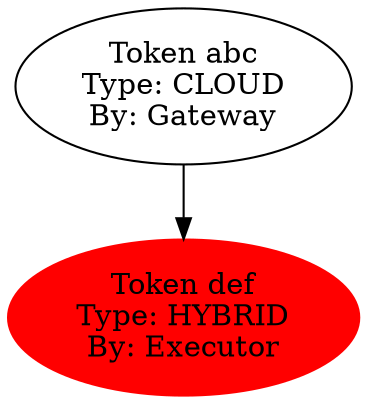

# Queryable Execution Kernel

## Architecture Evolution Complete

The system has evolved from a **trace-compressing orchestrator** to a **queryable execution kernel with runtime data structures**.

## Three Major Extensions Implemented

### 1. Deterministic Graph Hashing (`execution_graph_hash.h/cpp`)

**Purpose**: Enable diffing, caching, replay validation, regression detection

```cpp
// Hash execution structure
GraphHash topology = GraphHasher::hashTopology(root);
GraphHash outcome = GraphHasher::hashOutcome(root);

// Diff two executions
auto diff = GraphHasher::diff(expected, actual);
// Returns: addedNodes, removedNodes, modifiedNodes, isomorphic

// Cache subgraphs
GraphCache::instance().cacheSubgraph(hash, root);
auto cached = GraphCache::instance().retrieve(hash);

// Validate replay
ReplayValidator validator;
validator.recordExpected(expectedHash, executionId);
auto result = validator.validate(actualRoot, executionId);
// Returns: matches, divergences, expected/actual hashes
```

**Key Properties**:
- Topology hash = structure only (ignores timestamps)
- Outcome hash = results only (ignores structure)
- Full hash = Merkle tree of entire graph
- Deterministic across executions

### 2. Statistical Collapse (`statistical_collapse.h/cpp`)

**Purpose**: Upgrade from counts to rich statistical distributions

```cpp
// A collapsed node now contains:
struct StatisticalNodeModel {
    LatencyHistogram latency;           // p50, p95, p99
    FailureDistribution failures;       // error class distribution
    BackendRoutingDistribution routing; // backend entropy
    RetryPattern retries;               // retry success rate
};

// Record execution
StatisticalAggregator::instance().recordExecution(node);

// Predict behavior
double p95Latency = StatisticalAggregator::instance().predictLatency("inference", 0.95);
double failureRate = StatisticalAggregator::instance().predictFailureRate("inference");

// Adaptive tuning
RuntimeMode mode = AdaptivePolicyTuner::recommendRuntimeMode("inference");
int timeout = AdaptivePolicyTuner::recommendTimeoutMs("inference", 0.95);
```

**Key Properties**:
- Latency histograms with percentile tracking
- Failure classification and rates
- Backend routing entropy (load balancing insights)
- Retry pattern analysis
- Anomaly detection

### 3. Dual-Layer Graph View

**Purpose**: Separate internal (lossless) from external (compressed) views

```cpp
// Internal layer (full fidelity)
AgenticTaskNode internalRoot = BuildFullGraph(...);

// External layer (compressed projection)
std::string logView = SerializeGraphToLog(internalRoot);
// Collapsed nodes contain StatisticalNodeModel

// Query layer (runtime data structure)
GraphQuery query(internalRoot);
auto hotPaths = query.findHotPaths(10);
auto failures = query.findFailureClusters();
auto anomalies = query.findAnomalies();
```

## Complete Architecture

```
┌─────────────────────────────────────────────────────────────────┐
│                      USER CODE                                   │
└──────────────────────┬──────────────────────────────────────────┘
                       │
                       ▼
┌─────────────────────────────────────────────────────────────────┐
│              INFERENCE GATEWAY (Coordination)                    │
└──────────────────────┬──────────────────────────────────────────┘
                       │
         ┌─────────────┼─────────────┐
         ▼             ▼             ▼
┌──────────────┐ ┌──────────┐ ┌──────────────┐
│ PLAN COMPILER│ │  POLICY  │ │   TOKEN      │
│              │ │  ROUTER  │ │   AUTHORITY  │
└──────────────┘ └──────────┘ └──────────────┘
         │             │             │
         └─────────────┴─────────────┘
                       │
                       ▼
┌─────────────────────────────────────────────────────────────────┐
│              PLAN EXECUTOR (Verification)                        │
│  • Requires: Capability + Plan + Permit                        │
│  • Verifies: Token valid + Plan unmodified                     │
│  • Records: Lineage + Statistics + Hash                        │
└──────────────────────┬──────────────────────────────────────────┘
                       │
                       ▼
┌─────────────────────────────────────────────────────────────────┐
│              EXECUTION GRAPH (Runtime Data Structure)            │
│                                                                  │
│  ┌─────────────┐  ┌──────────────┐  ┌──────────────┐           │
│  │   AGENT    │  │   TASK       │  │   RESULT     │           │
│  │   NODE     │──│   NODE       │──│   NODE       │           │
│  └─────────────┘  └──────────────┘  └──────────────┘           │
│         │                │                 │                    │
│         ▼                ▼                 ▼                    │
│  ┌─────────────┐  ┌──────────────┐  ┌──────────────┐           │
│  │ Statistical│  │   Graph      │  │   Replay     │           │
│  │   Model    │  │   Hash       │  │   Validator  │           │
│  │ (collapsed)│  │ (identity)   │  │ (correctness)│           │
│  └─────────────┘  └──────────────┘  └──────────────┘           │
└─────────────────────────────────────────────────────────────────┘
                       │
         ┌─────────────┼─────────────┐
         ▼             ▼             ▼
┌──────────────┐ ┌──────────┐ ┌──────────────┐
│   GRAPH      │ │   QUERY  │ │   AUDIT      │
│   CACHE      │ │  ENGINE  │ │   EXPORT     │
└──────────────┘ └──────────┘ └──────────────┘
```

## Queryable Runtime Data Structures

### Graph Queries
```cpp
GraphQuery query(root);

// Find hot paths
auto hotPaths = query.findHotPaths(10);
// Returns: [(path_signature, execution_count, avg_latency)]

// Find failure clusters
auto failures = query.findFailureClusters();
// Returns: [(error_pattern, count, concentration)]

// Find anomalies
auto anomalies = query.findAnomalies();
// Returns: nodes with statistically unusual behavior

// Path analysis
auto criticalPath = query.criticalPath();
auto bottlenecks = query.bottlenecks();
```

### Statistical Queries
```cpp
StatisticalAggregator& agg = StatisticalAggregator::instance();

// Performance predictions
double p99 = agg.predictLatency("inference", 0.99);
double failureRate = agg.predictFailureRate("inference");

// Routing optimization
std::string bestBackend = agg.predictOptimalBackend("inference");

// Anomaly detection
bool isAnomaly = agg.isAnomalous(node);
auto reasons = agg.getAnomalyReasons(node);
```

### Hash-Based Queries
```cpp
GraphCache& cache = GraphCache::instance();

// Subgraph caching
GraphHash hash = GraphHasher::hashTopology(subgraph);
if (cache.contains(hash)) {
    auto cached = cache.retrieve(hash);
    // Reuse cached execution
}

// Regression detection
GraphHash current = GraphHasher::hashOutcome(root);
GraphHash baseline = loadBaseline();
if (ReplayValidator::detectRegression(current, baseline)) {
    // Alert on behavior change
}
```

## Observability Outputs

### 1. Execution Log (Canonical)
```json
{
  "executionId": "uuid",
  "graphHash": "abc123...",
  "rootNode": {
    "type": "AGENT",
    "state": "COMPLETED",
    "children": [...],
    "collapsed": {
      "latency": {"p50": 120, "p95": 450, "p99": 890},
      "failures": {"timeout": 3, "error": 1},
      "routing": {"ollama": 45, "cloud": 12}
    }
  }
}
```

### 2. Lineage Graph (DOT format)


### 3. Statistical Models (JSON)
```json
{
  "nodeType": "inference",
  "latency": {"buckets": [10, 50, 100, 500, 1000, 0], "p95": 450},
  "failures": {"classes": {"timeout": 3, "rate_limit": 1}},
  "routing": {"entropy": 0.85, "dominant": "ollama"}
}
```

## Security & Correctness Properties

| Property | Mechanism |
|----------|-----------|
| **Deterministic Replay** | Graph hashing + lineage |
| **Statistical Learning** | Collapsed node models |
| **Anomaly Detection** | Distribution comparison |
| **Adaptive Routing** | Predicted optimal backend |
| **Regression Detection** | Hash comparison over time |
| **Subgraph Caching** | Topology hash as key |
| **Audit Reconstruction** | Lineage graph export |

## Next Evolution (Future)

From here, the natural next steps are:

1. **Distributed Execution Graphs**: Cross-node lineage tracking
2. **ML-Based Prediction**: Train models on statistical history
3. **Automatic Policy Synthesis**: Generate policies from observed patterns
4. **Formal Verification**: Prove properties of execution graphs
5. **Interactive Debugging**: Step-through execution with full state

## Summary

The system is now:
- **Queryable**: Runtime data structures for analysis
- **Deterministic**: Hash-based identity and validation
- **Statistical**: Rich distributions, not just counts
- **Adaptive**: Self-tuning based on observed behavior
- **Auditable**: Complete provenance and reconstruction

This is a **provable execution kernel** with structural guarantees at every layer.
