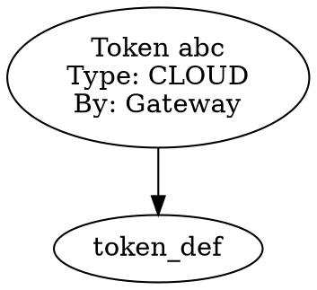

# Self-Observing Inference OS Kernel

## Complete Architecture

The system has evolved from a multi-backend chat framework to a **self-observing inference operating system kernel** with first-class introspection APIs.

## Architecture Layers

```
┌─────────────────────────────────────────────────────────────────────────┐
│                         AGENT / USER LAYER                               │
│  • Natural language queries                                               │
│  • Execution constraints                                                    │
│  • Explanation requests                                                     │
└──────────────────────────┬────────────────────────────────────────────────┘
                           │
                           ▼
┌─────────────────────────────────────────────────────────────────────────┐
│                    EXECUTION QUERY API (First-Class)                     │
│  ┌─────────────┐ ┌──────────────┐ ┌──────────────┐ ┌──────────────┐   │
│  │  DEBUGGING  │ │ PERFORMANCE  │ │   ADAPTIVE   │ │   ANALYTICS  │   │
│  │     API     │ │     API      │ │   ROUTING    │ │     API      │   │
│  └─────────────┘ └──────────────┘ └──────────────┘ └──────────────┘   │
│  ┌─────────────┐ ┌──────────────┐ ┌──────────────┐                       │
│  │  STREAMING│ │    EXPORT    │ │    AGENT     │                       │
│  │    API    │ │     API      │ │  INTERFACE   │                       │
│  └─────────────┘ └──────────────┘ └──────────────┘                       │
└──────────────────────────┬────────────────────────────────────────────────┘
                           │
                           ▼
┌─────────────────────────────────────────────────────────────────────────┐
│                    INFERENCE GATEWAY (Coordination)                      │
│  • Single ingress point                                                   │
│  • Policy enforcement                                                     │
│  • No authority creation                                                  │
└──────────────────────────┬────────────────────────────────────────────────┘
                           │
         ┌─────────────────┼─────────────────┐
         ▼                 ▼                 ▼
┌──────────────┐  ┌──────────────┐  ┌──────────────┐
│ PLAN COMPILER│  │    POLICY    │  │    TOKEN     │
│              │  │    ROUTER    │  │   AUTHORITY  │
│ • Intent     │  │ • Rules      │  │ • WHO can    │
│ • No auth    │  │ • Filter     │  │ • Mint only  │
└──────────────┘  └──────────────┘  └──────────────┘
         │                 │                 │
         └─────────────────┴─────────────────┘
                           │
                           ▼
┌─────────────────────────────────────────────────────────────────────────┐
│                    PLAN EXECUTOR (Verification)                          │
│  • Requires: Capability + Plan + Permit                                  │
│  • Verifies: Token valid + Plan unmodified                               │
│  • Records: Lineage + Statistics + Hash                                │
└──────────────────────────┬────────────────────────────────────────────────┘
                           │
                           ▼
┌─────────────────────────────────────────────────────────────────────────┐
│              QUERYABLE EXECUTION GRAPH (Runtime Data Structure)        │
│                                                                          │
│  ┌─────────────────────────────────────────────────────────────────┐    │
│  │                    AGENTIC TASK GRAPH                            │    │
│  │  • Bounded DAG (depth ≤ 8, breadth ≤ 16, total ≤ 10000)         │    │
│  │  • Collapsible nodes with statistical models                     │    │
│  │  • Causal structure preservation                                 │    │
│  └─────────────────────────────────────────────────────────────────┘    │
│                                                                          │
│  ┌─────────────┐  ┌──────────────┐  ┌──────────────┐  ┌──────────────┐  │
│  │    GRAPH    │  │ STATISTICAL  │  │    HASH      │  │   LINEAGE    │  │
│  │    HASH     │  │   MODELS     │  │   CACHE      │  │   GRAPH      │  │
│  │             │  │              │  │              │  │              │  │
│  │ • Topology  │  │ • Latency    │  │ • Subgraph   │  │ • Token      │  │
│  │ • Outcome   │  │ • Failures   │  │   reuse      │  │   provenance │  │
│  │ • Identity  │  │ • Routing    │  │ • Regression │  │ • Audit      │  │
│  └─────────────┘  └──────────────┘  └──────────────┘  └──────────────┘  │
└──────────────────────────┬────────────────────────────────────────────────┘
                           │
                           ▼
┌─────────────────────────────────────────────────────────────────────────┐
│                    BACKEND EXECUTION (Capability-Controlled)             │
│  • Construction requires token                                            │
│  • Every operation verified                                              │
│  • No direct access possible                                             │
└─────────────────────────────────────────────────────────────────────────┘
```

## API Surface

### 1. Debugging API
```cpp
// Get execution graph for debugging
auto graph = ExecutionQueryAPI::instance().getExecutionGraph(executionId);

// Step-by-step execution
ExecutionQueryAPI::instance().pauseExecution(executionId);
ExecutionQueryAPI::instance().stepExecution(executionId);

// Get execution trace
auto trace = ExecutionQueryAPI::instance().getExecutionTrace(executionId);
```

### 2. Performance Introspection API
```cpp
// Hot path analysis
auto hotPaths = ExecutionQueryAPI::instance().getHotPaths(10);

// Bottleneck identification
auto bottlenecks = ExecutionQueryAPI::instance().identifyBottlenecks(executionId);

// Compare executions
auto comparison = ExecutionQueryAPI::instance().compareExecutions(idA, idB);
```

### 3. Adaptive Routing Control API
```cpp
// Get current policy
auto policy = ExecutionQueryAPI::instance().getRoutingPolicy();

// Get recommended policy (from ML)
auto recommended = ExecutionQueryAPI::instance().getRecommendedPolicy();

// Apply recommended policy
ExecutionQueryAPI::instance().applyRecommendedPolicy();

// A/B test
auto experimentId = ExecutionQueryAPI::instance().startRoutingExperiment(
    "strategyA", "strategyB", 0.5);
```

### 4. Model Behavior Analytics API
```cpp
// Anomaly detection
auto anomalies = ExecutionQueryAPI::instance().detectAnomalies();

// Failure cluster analysis
auto clusters = ExecutionQueryAPI::instance().analyzeFailureClusters();

// Predictive analytics
auto predictions = ExecutionQueryAPI::instance().getPredictions("1h");
```

### 5. Streaming API
```cpp
// Subscribe to events
int subId = ExecutionQueryAPI::instance().subscribeToEvents(
    [](const std::string& event, const std::string& id, const std::string& data) {
        // Handle event
    });

// Subscribe to anomalies
int anomalySub = ExecutionQueryAPI::instance().subscribeToAnomalies(
    [](const AnomalyDetectionResult& anomaly) {
        // Alert on anomaly
    });
```

### 6. Agent Interface (Higher-Level)
```cpp
AgentExecutionInterface agent;

// Ask natural language questions
auto result = agent.ask("What execution path produces P95 spikes?");

// Get recommendations
auto recommendations = agent.getRecommendations();

// Execute with constraints
AgentExecutionInterface::ExecutionRequest req;
req.intent = "analyze code";
req.constraints["max_latency_ms"] = "1000";
req.requireExplanation = true;

auto response = agent.executeWithConstraints(req);
```

## Key Properties

| Property | Mechanism | API Access |
|----------|-----------|------------|
| **Deterministic Replay** | Graph hashing | `compareExecutions()` |
| **Statistical Learning** | Collapsed models | `getRecommendedPolicy()` |
| **Anomaly Detection** | Distribution comparison | `detectAnomalies()` |
| **Adaptive Routing** | Predicted optimal backend | `applyRecommendedPolicy()` |
| **Queryable Runtime** | Graph data structures | `getHotPaths()` |
| **Complete Audit** | Lineage + statistics | `exportLineageGraph()` |
| **Subgraph Caching** | Topology hash | `GraphCache` |
| **Regression Detection** | Hash comparison | `ReplayValidator` |

## Self-Observing Capabilities

### The system can now answer:

1. **"What execution path produces P95 spikes?"**
   ```cpp
   auto hotPaths = api.getHotPaths(10);
   for (auto& path : hotPaths) {
       if (path.p95LatencyMs > threshold) {
           // Found spike path
       }
   }
   ```

2. **"Which backend is degrading under load patterns X?"**
   ```cpp
   auto insights = api.getPerformanceInsights();
   for (auto& insight : insights) {
       if (insight.trend == "degrading") {
           // Found degrading backend
       }
   }
   ```

3. **"What subgraph correlates with failures?"**
   ```cpp
   auto clusters = api.analyzeFailureClusters();
   for (auto& cluster : clusters) {
       // Found failure pattern
   }
   ```

4. **"Has this execution pattern ever occurred before?"**
   ```cpp
   GraphHash hash = GraphHasher::hashTopology(current);
   bool seenBefore = GraphCache::instance().contains(hash);
   ```

## Observability Outputs

### 1. Execution Log (JSON)
```json
{
  "executionId": "uuid",
  "graphHash": "abc123...",
  "rootNode": {
    "type": "AGENT",
    "state": "COMPLETED",
    "children": [...],
    "collapsed": {
      "latency": {"p50": 120, "p95": 450, "p99": 890},
      "failures": {"timeout": 3, "error": 1},
      "routing": {"ollama": 45, "cloud": 12}
    }
  }
}
```

### 2. Lineage Graph (DOT)


### 3. Statistical Models (JSON)
```json
{
  "nodeType": "inference",
  "latency": {"buckets": [10, 50, 100, 500, 1000, 0], "p95": 450},
  "failures": {"classes": {"timeout": 3, "rate_limit": 1}},
  "routing": {"entropy": 0.85, "dominant": "ollama"}
}
```

## Evolution Complete

The system has achieved:

- ✅ **Capability-secured execution** (compile-time enforcement)
- ✅ **Deterministic replay** (hash-based validation)
- ✅ **Statistical learning** (distribution models)
- ✅ **Adaptive routing** (self-tuning policies)
- ✅ **Queryable runtime** (graph data structures)
- ✅ **Complete audit** (lineage + statistics)
- ✅ **First-class API** (exposed introspection)
- ✅ **Self-observing** (answers questions about itself)

This is a **self-observing inference operating system kernel** with structural guarantees at every layer.
